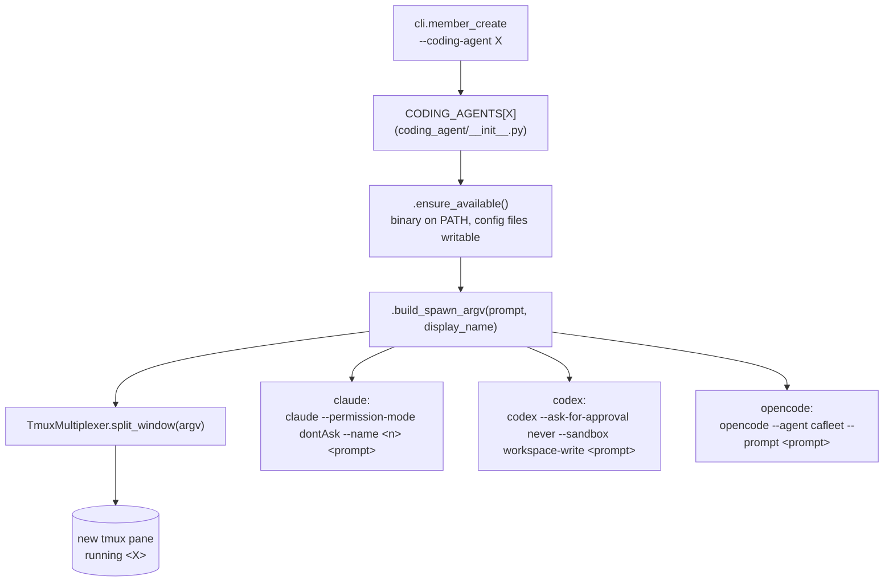

# Coding agents

cafleet supports three coding-agent binaries inside member panes: `claude`
(Claude Code), `codex` (OpenAI Codex CLI), and `opencode` (opencode.ai). The
backend is selected at session-create and member-create time via
`--coding-agent {claude,codex,opencode}`; the default is `claude` so existing
invocations behave unchanged.

## Backend resolution

| Backend | Spawn command | Notes |
|---|---|---|
| `claude` | `claude --permission-mode dontAsk --name <member-name> <prompt>` | Pane title derives from `--name` via Claude Code's terminal-title escape. |
| `codex`  | `codex --ask-for-approval never --sandbox workspace-write <prompt>` | No `--name` analog; pane title is whatever `codex` emits by default. Operators locate panes via `cafleet member list`. |
| `opencode` | `opencode --agent cafleet --prompt <prompt>` | No `--name` analog. Long-lived TUI bound to the `cafleet` agent definition at `~/.opencode/agents/cafleet.md`, materialized on first spawn from the in-source `CAFLEET_AGENT` dataclass preset via `OpencodeAgent.ensure_available()` with skip-if-exists semantics. Safety floor matches Claude Code's `dontAsk` posture (catch-all-allow + specific-deny ruleset enforced by opencode's own permission system) — NOT Codex's kernel sandbox. |

All three backends honor a leading-`!` shell shortcut on the coding agent's
input line, so `cafleet member exec` keystrokes `! <command>` + Enter into
any pane shape and the command runs natively. The `--coding-agent` value is
recorded in `agent_placements.coding_agent` (free-text `String` column). The
CLI's `click.Choice(...)` enum gate is computed dynamically from
`list(CODING_AGENTS.keys())` (currently `["claude", "codex", "opencode"]`)
so adding a future backend is one entry in the `CODING_AGENTS` registry.

Mixed-backend teams are allowed: a single Director may spawn `claude`,
`codex`, and `opencode` members in the same session with no broker-level
differences.

For `cafleet session create`, the `--coding-agent` flag is operator-declared
metadata only — cafleet does not spawn the root Director's coding-agent
process and cannot auto-detect what is already running, so the operator
declares which binary is in the pane. For `cafleet member create`, the flag
both selects the registry entry whose `build_spawn_argv` produces the spawn
argv AND is recorded as placement metadata.

## Known asymmetries (intentional non-goals)

- **Pane title.** Only the `claude` spawn argv carries `--name`, so `codex`
  and `opencode` panes do not display the member name in their pane title.
  Use `cafleet member list --agent-id <director>` to find a specific
  member's pane id; the `pane_id` column is ground truth for all three
  backends.
- **Bash-disable parity.** Neither codex nor opencode has a
  `--disallowedTools` analog. The bash-via-Director protocol is a fallback
  for harness-deny-listed destructive commands (e.g. `git push`), not a
  tool-permission gate, so the asymmetry does not affect the routing
  protocol.
- **Sandbox isolation.** Only `codex` provides OS-level (kernel-enforced)
  isolation via `--sandbox workspace-write`. Both `claude` and `opencode`
  rely on deny-list-only safety floors; operators who need kernel-enforced
  isolation should use the `codex` backend.

Operational details for codex members — including the codex CLI version
pin, install pointer, and verification recipe — live at
[Codex members](../reference/coding-agents/codex.md). The equivalent for
opencode lives at [Opencode members](../reference/coding-agents/opencode.md),
including the `CAFLEET_AGENT` preset materialization protocol and the
refresh recipe for upgrading the preset after a CAFleet release.
