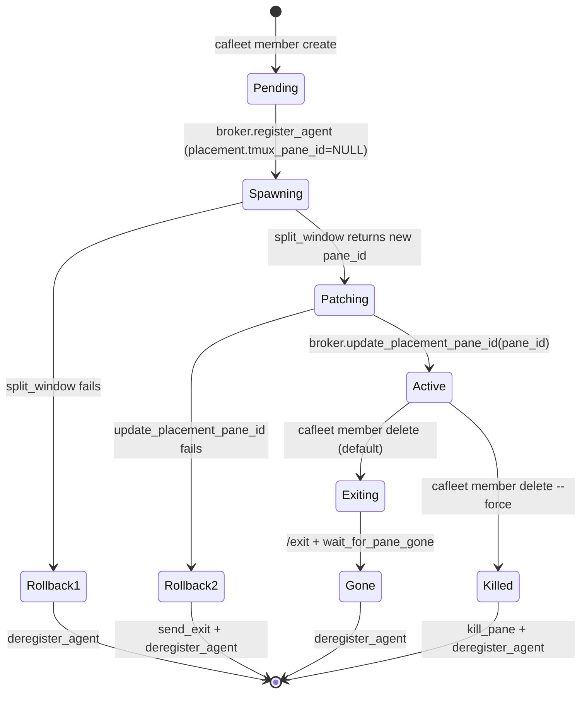

# Member lifecycle

The `cafleet member` CLI subgroup wraps the two-step "register an agent +
spawn a tmux pane" recipe behind a single command and persists the
agent-to-pane mapping in the registry SQLite store via the `agent_placements`
table.

**Terminology**: A "member" is an agent spawned by a Director via
`cafleet member create`. It has an associated placement row linking it to a
specific tmux pane, window, and session. The Director itself is NOT a member
— it registers with plain `cafleet agent register`.

## Lifecycle state diagram

## Atomic create flow

`cafleet member create`:

1. Register the member agent with a pending placement
   (`tmux_pane_id = NULL`, `coding_agent` field) via
   `broker.register_agent(placement=...)`.
2. Spawn the member pane in the Director's own tmux window via
   `TmuxMultiplexer.split_window`, which internally runs
   `tmux split-window -t <window_id> -d` and a best-effort `tmux
   select-layout main-vertical` (suppressed on `TmuxError`), capturing the
   new pane ID. The spawn argv is built per backend (see
   [Coding agents](coding-agents.md)). The `-d` flag is unconditional: the
   new pane is not made active, and the calling client's active window is
   not switched — so a Director monitoring window `@5` while its pane lives
   in `@3` continues to see `@5` after the spawn lands in `@3`.
3. Patch the placement row with the real pane ID via
   `broker.update_placement_pane_id()`.

If step 2 fails, the registered agent is rolled back via
`broker.deregister_agent()`. If step 3 fails, the pane is `/exit`'d and the
agent rolled back.

## Spawn-prompt input modes

`cafleet member create` accepts the spawn prompt either as a variadic
positional argument (`-- "<prompt text>"`) or via `--prompt-file <abs path>`
(UTF-8 file). The two are mutually exclusive — supplying both is a
`click.UsageError`. `--prompt-file` requires an absolute path so the CLI
does not need to know the caller's `${BASE}`; the absolute-path check,
existence check, UTF-8 decode, and emptiness check all run inside
`_read_prompt_file` during prompt resolution (after
`broker.register_agent()` has allocated the new agent id), and any failure
rolls back the registration.

The file contents are read verbatim (no stripping) and pass through the same
`str.format()` substitution (`session_id` / `agent_id` /
`director_agent_id`) as the inline form. The file path is the input AND the
permanent audit artifact: every CAFleet-native team skill writes its
rendered spawn prompt to `<BASE>/prompts/<role>-<UTC-compact>.md` before
invoking `member create --prompt-file`, so the on-disk file is the source of
truth for what was spawned. Inline `-- "<prompt>"` invocation remains
supported for trivial one-line ad-hoc spawns; long, templated identity
blocks must use `--prompt-file` because the rendered text otherwise exceeds
the documented `tmux split-window` argv ceiling.

## Delete ordering

Default path: send `/exit`, poll `list-panes` until the pane disappears
(15 s timeout), then deregister. On timeout, capture the pane tail and fail
loudly with exit code 2; operator reruns with `--force` for an atomic
kill+deregister.

## Pane display-name propagation (claude backend only)

When the placement is created with `coding_agent="claude"`, `member_create`
resolves the spawn argv via
`CODING_AGENTS["claude"].build_spawn_argv(prompt, display_name=name)`, which
returns `["claude", "--permission-mode", "dontAsk", "--name", <member-name>,
<prompt>]`, so the `--name` flag is forwarded to the spawned process and
Claude Code re-emits the name via the terminal title escape sequence.
Neither `codex` nor `opencode` has a `--name` analog and so their panes show
whatever default title the binary emits — see
[Coding agents](coding-agents.md) for the asymmetry note. `tmux
display-message -p -t <pane> "#{pane_title}"` returns the member name for
the lifetime of a `claude` pane.

## Commands

`member create`, `member delete`, `member list` (with `--activity` for
per-member `last_sent` / `last_recv` / `last_ack` / `idle` aggregation),
`member capture`, `member send-input`, `member exec`, `member ping`. All
require `--agent-id` (the Director's ID). The `cafleet.multiplexer`
subpackage isolates all subprocess interaction with the terminal
multiplexer behind the `Multiplexer` Protocol; the `TmuxMultiplexer`
concrete impl wraps every `tmux` invocation. Primitives for pane lifecycle
inspection and forced teardown — `pane_exists`, `kill_pane`, and
`wait_for_pane_gone` — live there as `TmuxMultiplexer` methods so the CLI
reaches them via `MULTIPLEXERS["tmux"].X(...)` and never calls `tmux`
directly.

`cafleet member exec` is the bash-routing primitive — see
[Bash routing](bash-routing.md).

## Write-path authorization

`cafleet member send-input` — a safe `tmux send-keys` wrapper for answering
an `AskUserQuestion` prompt — reuses the exact `member capture`
authorization boundary (`placement.director_agent_id == --agent-id`,
non-null `tmux_pane_id`, placement row present). The CLI accepts exactly
one of `--choice {1,2,3}` (sends the matching digit key) or `--freetext
"<text>"` (sends `4`, the literal text via tmux's `-l` flag, then `Enter` —
`4` selects the "Type something" option). Both modes are AskUserQuestion-
only. `--freetext` rejects values whose first non-whitespace character is
`!` so the AskUserQuestion path cannot smuggle a Claude Code `!`-shortcut;
shell dispatch goes through `cafleet member exec` instead. Newlines are
rejected for `--freetext` at both the CLI layer and the helper, so each
call is exactly one prompt submission. The helper never invokes a shell
(`subprocess.run([...], shell=False)`), so shell meta, backticks, `$VAR`,
and multi-byte characters pass through as literal input.

`cafleet member exec <command>` is the Director-only shell-dispatch
subcommand. It accepts a single required positional `CMD` argument, reuses
the same authorization boundary as `member send-input`, and keystrokes
`! <command>` + `Enter` into the member's pane via
`MULTIPLEXERS["tmux"].send_bash_command` so Claude Code's `!` shortcut runs
the command natively. Empty / whitespace-only / newline-containing
commands are rejected at the CLI handler with exit 2; cross-Director,
missing-placement, and pending-placement rejections share their wording
with `member send-input`.

## Operator diagnostics

`cafleet doctor` prints the calling pane's session / window / pane
identifiers (plus `$TMUX_PANE`) for operators diagnosing placement issues
without reaching for raw tmux commands. It is a top-level command — not a
member-family command — but resolves the active multiplexer via the
registry (`MULTIPLEXERS["tmux"].ensure_available()` +
`.context_discovery()`) so the TMUX-required wording stays consistent with
the member surface.

## Base-dir resolution

The `cafleet base-dir` subgroup is the authoritative resolver for the
`${BASE}` output-root used by every CAFleet scratch / audit / figure write.
Like `cafleet doctor`, it operates on the local filesystem only and does
NOT require `--session-id`. Two subcommands:

- `cafleet base-dir resolve [TASK_NAME] [--json]` — probe-only resolution.
  With no positional argument, emits one of three statuses: `resolved`
  (BASE determined from CWD inference or an existing anchor),
  `needs-user-input` (CWD is `$HOME` or under `$HOME/.claude` and no usable
  anchor exists — Claude drives `AskUserQuestion` on the returned
  candidates), or a non-zero exit with a standardized error (anchor schema
  / version mismatch). With a positional `TASK_NAME`, engages the
  task-scope branch: walks up from CWD via `is_git_repo_root` to infer the
  repo root, joins `TASK_NAME` against it, auto-creates the task folder via
  `pathlib.Path(...).mkdir(parents=True, exist_ok=True)`, writes an anchor
  inline at `<task-folder>/.cafleet-base-dir.json` (`source: "task-scope"`),
  and returns `{status: "resolved", base: <abs task-folder>, source:
  "task-scope" | "anchor", anchor: <abs anchor>, task_name: <TASK_NAME>}`.
  An absolute-path `TASK_NAME` is accepted only when it lives strictly under
  the inferred repo root (the path is then used verbatim as the task
  folder); otherwise the `unset` shape is returned. Never falls back to
  `/tmp` silently.
- `cafleet base-dir record --base <abs-path> --source askuserquestion` —
  persist an anchor at `<abs-path>/.cafleet-base-dir.json` after Claude has
  driven `AskUserQuestion`. Idempotent: matching re-runs are no-ops;
  mismatched re-runs error.

The anchor schema is version-locked at `1` and rejected on any other value
(silent forward-compatibility would let two installations at different
cafleet versions disagree about BASE). `resolved_at` follows the same
UTC-microsecond `+00:00` convention as cafleet `status_timestamp`.

The `<unset>` sentinel (literal string `"<unset>"`, case-sensitive) is
returned only when the caller passed an absolute-path argument. Consumers
MUST guard every BASE-derived write site with an explicit `${BASE} !=
<unset>` check; reaching an unguarded `Path(BASE) / …` aborts with `Error:
BASE is <unset>; refusing to fall back to /tmp`. The Director's spawn-
prompt substitution mirrors this — when `${BASE}` is `<unset>`, the `BASE:`
line is omitted from spawn prompts entirely so spawned members naturally
treat audit-file features as disabled.

## Supervision skills

The Director's monitoring obligations are split across two skills.
`skills/cafleet-agent-team-monitoring/SKILL.md` is the foundation layer — it
documents the cron-like loop primitive per backend (Claude Code uses
`CronCreate` + `/loop`; codex has no in-session scheduling and uses
fallback options), the team-facilitation instructions, the 2-stage health
check protocol (message poll then terminal capture), and the `/loop` prompt
template. `skills/cafleet-agent-team-supervision/SKILL.md` is the
governance layer — it loads the monitoring skill as a hard prerequisite and
adds the always-applicable obligations (Core Principle, Idle Semantics,
Authorization-Scope Guard, Spawn Protocol, User Delegation, Cleanup). Load
both skills before spawning any members.
