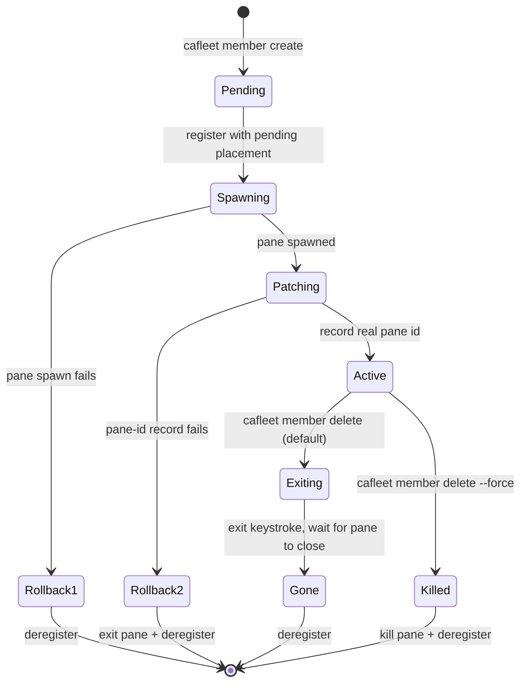

# Member lifecycle

The `cafleet member` CLI group wraps the two-step "register an agent + spawn a
tmux pane" recipe behind `cafleet member create` and persists the agent-to-pane
mapping in the `agent_placements` table. A "member" is an agent with a placement
row — spawned by a Director via `cafleet member create`, linking it to a specific
tmux pane, window, and session. The Director itself is NOT a member — it is
bootstrapped internally by `cafleet fleet create`, along with the built-in
Administrator.

**Single-Director invariant**: A fleet has exactly one Director — the root
Director recorded in `fleets.director_agent_id` at `fleet create` time. Only
that root Director may own members, so every member's
`agent_placements.director_agent_id` equals the fleet root. A member can never
be another member's Director: member registration rejects any placement whose
`director_agent_id` is not the fleet root. The team model is a single flat
tier; there is no team nesting.

## Lifecycle state diagram

## Atomic create flow

`cafleet member create` is atomic: it registers the member agent with a
pending placement (no pane id yet), spawns the member pane in the Director's
own tmux window, then patches the placement row with the real pane id. If the
spawn or the patch fails, the registration is rolled back. The new pane is
created without stealing focus, so the Director's active window is unchanged.
Identity reaches the spawned pane as literals rendered into the prompt:
`cafleet member create` runs `str.format` over the resolved prompt,
substituting `{fleet_id}`, `{agent_id}` (the member's own newly-allocated id),
`{director_agent_id}`, and `{coding_agent}` — see
[Coding agents](coding-agents.md).

## Delete ordering

`cafleet member delete` tears down the pane (when one exists) and
soft-deletes the agent. Default path: send the backend exit keystroke and submit
it (separate keystrokes with a short settle gap, so every backend's input line
registers the command before Enter), poll `list-panes` until the pane disappears
(15 s timeout), then deregister. On timeout, capture the pane tail and fail
loudly with exit code 2; the operator reruns with `--force` for an atomic
kill+deregister. A member with a pending placement (no pane yet) is a plain
registry soft-delete, and so is a placementless agent (no placement row) —
`cafleet member delete` soft-deletes both without touching tmux.

## Spawn-prompt input modes

The spawn prompt is supplied inline via `--text "<prompt>"` or from a file via
`--text-file <path>` (an absolute or CWD-relative UTF-8 path; `-` reads the
whole prompt from stdin); literal braces in prompt text must be doubled (`{{`,
`}}`) — see [CLI options](../spec/cli-options.md) `member create`.

## Commands

The lifecycle ops live in the `member` group: `member create`, `member delete`
(with `--force` for an atomic kill+deregister), `member show` (single-agent
detail — kind, skills, placement block), and `member list` (with `--activity`
for per-member activity aggregation, or `--all` to list every active agent of
the fleet with a `kind` column). Keystroke interaction lives
in the same group: `member capture`, `member exec`, `member ping`, and
`member nudge`. `member create` takes `--agent-id` (the spawning Director's ID,
which must equal the fleet root); every other lifecycle verb targets its member
by `--member-id`, scoped to the per-subcommand `--fleet-id` (`member nudge`
additionally takes `--agent-id` for the sender). See
[CLI options](../spec/cli-options.md) for every flag and the shared
resolution rules.

`cafleet member exec` is the bash-routing primitive — see
[Bash routing](bash-routing.md).
