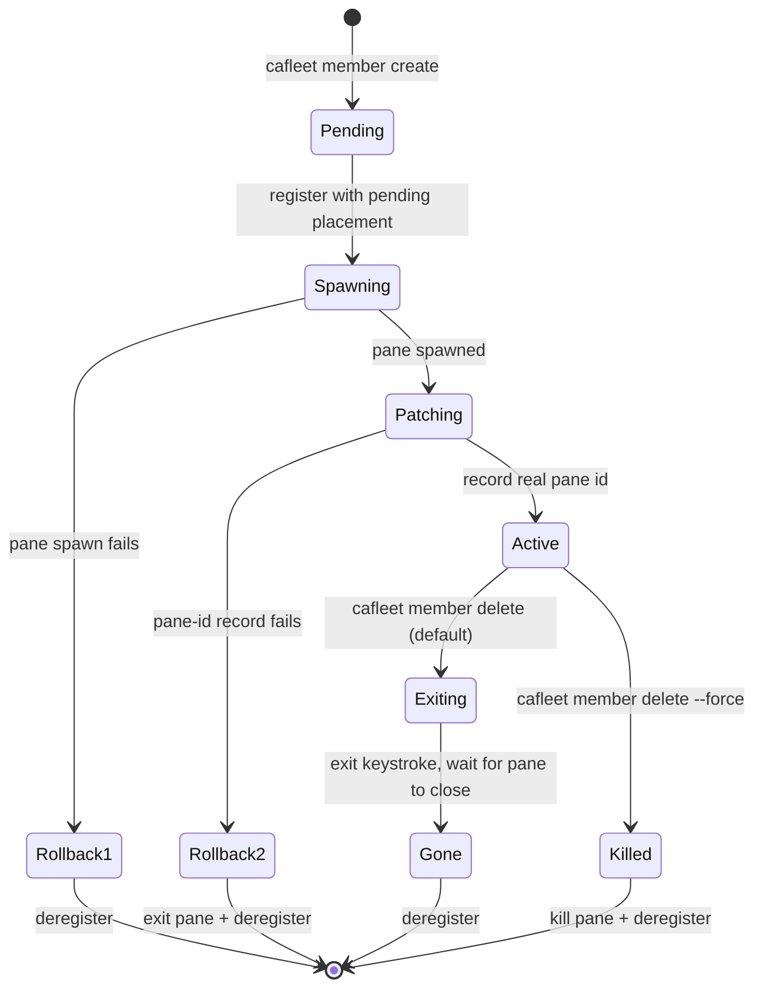

# Member lifecycle

The `cafleet member` CLI group wraps the two-step "register + spawn a
tmux pane" recipe behind `cafleet member create` and persists the member-to-pane
mapping in the `member_placements` table. An ordinary member is an active
registry row with a placement row, other than the fleet's root Director —
spawned by a Director via `cafleet member create`, linking it to a specific
tmux pane, window, and session. The root Director is not an ordinary member —
it is bootstrapped internally by `cafleet fleet create` (keeping its own
placement row, since it is pane-bound), along with the built-in Administrator.

**Single-Director invariant**: A fleet has exactly one Director — the root
Director recorded in `fleets.director_member_id` at `fleet create` time. Only
that root Director may own members: `cafleet member create` resolves the
Director from the fleet row itself, so a member can never be another member's
Director by construction. The team model is a single flat tier; there is no
team nesting.

## Lifecycle state diagram

## Atomic create flow

`cafleet member create` is atomic: it registers the member with a
pending placement (no pane id yet), spawns the member pane in the Director's
own tmux window, then patches the placement row with the real pane id. If the
spawn or the patch fails, the registration is rolled back. The new pane is
created without stealing focus, so the Director's active window is unchanged.
Identity reaches the spawned pane as literals rendered into the prompt:
`cafleet member create` runs `str.format` over the resolved prompt,
substituting `{fleet_id}`, `{member_id}` (the member's own newly-allocated id),
`{director_member_id}`, and `{coding_agent}` — see
[Coding agents](coding-agents.md).

## Delete ordering

`cafleet member delete` tears down the pane (when one exists) and
soft-deletes the member. Default path: send the backend exit keystroke and submit
it (separate keystrokes with a short settle gap, so every backend's input line
registers the command before Enter), wait for the pane to close (15 s timeout),
then deregister. On a backend where the coding agent *is* the pane's foreground
process (tmux), the exit closes the pane directly. On a backend whose pane hosts
a persistent shell that outlives its agent (herdr), the default path first waits
for the coding agent to exit back to the shell, then closes the now-shell-only
pane. On timeout, capture the pane tail and fail loudly with exit code 2; the
operator reruns with `--force` for an atomic kill+deregister. A member with a
pending placement (no pane yet) is a plain registry soft-delete, and so is a
placementless registry row (no placement row) — `cafleet member delete`
soft-deletes both without touching the multiplexer.

## Spawn-prompt input modes

The spawn prompt is supplied inline via `--text "<prompt>"` or from a file via
`--text-file <path>` (an absolute or CWD-relative UTF-8 path; `-` reads the
whole prompt from stdin); literal braces in prompt text must be doubled (`{{`,
`}}`) — see [CLI options](../spec/cli-options.md) `member create`.

## Commands

The lifecycle ops live in the `member` group: `member create`, `member delete`
(with `--force` for an atomic kill+deregister), `member show` (single-member
detail — kind, skills, placement block), and `member list` (with `--activity`
for per-member activity aggregation, or `--all` to list every active registry
entry of the fleet with a `kind` column). Keystroke interaction lives
in the same group: `member capture`, `member exec`, `member ping`, and
`member nudge`. `member create` takes no identity flag — the CLI resolves the
Director from `fleets.director_member_id`; every other lifecycle verb targets
its member by `--member-id`, scoped to the per-subcommand `--fleet-id`
(`member nudge` names both parties: `--from-member-id` for the sender and
`--to-member-id` for the target). See
[CLI options](../spec/cli-options.md) for every flag and the shared
resolution rules.

`cafleet member exec` is the shell-dispatch primitive of the
bash-via-Director fallback protocol — see
[CLI options](../spec/cli-options.md#member-exec).
