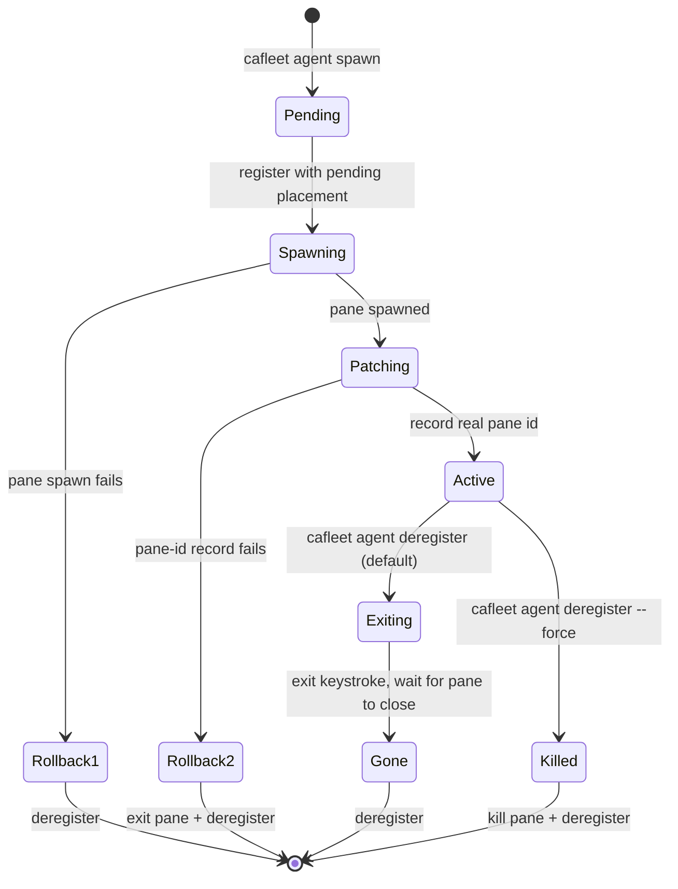

# Member lifecycle

The `cafleet agent` CLI group wraps the two-step "register an agent + spawn a
tmux pane" recipe behind `cafleet agent spawn` and persists the agent-to-pane
mapping in the `agent_placements` table. A "member" is an agent with a placement
row — spawned by a Director via `cafleet agent spawn`, linking it to a specific
tmux pane, window, and session. The Director itself is NOT a member — it
registers with plain `cafleet agent register`.

**Single-Director invariant**: A fleet has exactly one Director — the root
Director recorded in `fleets.director_agent_id` at `fleet create` time. Only
that root Director may own members, so every member's
`agent_placements.director_agent_id` equals the fleet root. A member can never
be another member's Director: member registration rejects any placement whose
`director_agent_id` is not the fleet root. The team model is a single flat
tier; there is no team nesting.

## Lifecycle state diagram

## Atomic create flow

`cafleet agent spawn` is atomic: it registers the member agent with a
pending placement (no pane id yet), spawns the member pane in the Director's
own tmux window, then patches the placement row with the real pane id. If the
spawn or the patch fails, the registration is rolled back. The new pane is
created without stealing focus, so the Director's active window is unchanged.
Identity reaches the spawned pane as environment variables (`CAFLEET_FLEET_ID`,
`CAFLEET_AGENT_ID`, `CAFLEET_DIRECTOR_AGENT_ID`) — see
[Coding agents](coding-agents.md).

## Deregister ordering

`cafleet agent deregister` tears down the pane (when one exists) and
soft-deletes the agent. Default path: send the backend exit keystroke and submit
it (separate keystrokes with a short settle gap, so every backend's input line
registers the command before Enter), poll `list-panes` until the pane disappears
(15 s timeout), then deregister. On timeout, capture the pane tail and fail
loudly with exit code 1; the operator reruns with `--force` for an atomic
kill+deregister. An agent with no pane (a registry-only agent, or a pending
placement) is a plain registry soft-delete.

## Spawn-prompt input modes

The spawn prompt is supplied inline (`-- "<prompt>"`) or via `--prompt-file`
(an absolute UTF-8 path), delivered verbatim — see
[CLI options](../spec/cli-options.md) `agent spawn`.

## Commands

The lifecycle ops live in the `agent` group: `agent spawn`, `agent deregister`
(with `--force` for an atomic kill+deregister), and `agent list` (with
`--activity` for per-agent activity aggregation). Keystroke interaction lives in
the `pane` group: `pane capture`, `pane input`, `pane exec`, and `pane wake`.
`agent spawn` takes `--agent-id` (the spawning Director's ID, which must equal
the fleet root); the `pane *` ops and `agent deregister` target by `--agent-id`
(the target), scoped to the per-subcommand `--fleet-id`. See
[CLI options](../spec/cli-options.md) for every flag and the shared
resolution rules.

`cafleet pane exec` is the bash-routing primitive — see
[Bash routing](bash-routing.md).
