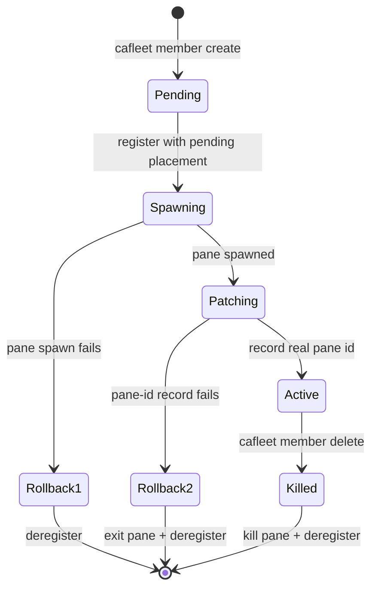

# Member lifecycle

The `cafleet member` CLI group wraps the two-step "register + spawn a
tmux pane" recipe behind `cafleet member create` and persists the member-to-pane
mapping in the `member_placements` table. An ordinary member is an active
registry row with a placement row other than the fleet's root Director,
spawned by a Director via `cafleet member create` and linked to a specific
tmux pane, window, and session. The root Director is instead bootstrapped
internally by `cafleet fleet create`, keeping its own placement row since it
is pane-bound.

**Single-Director invariant**: A fleet has exactly one Director — the root
Director recorded in `fleets.director_member_id` at `fleet create` time. Only
that root Director may own members: `cafleet member create` resolves the
Director from the fleet row itself, so a member can never be another member's
Director by construction. The team model is a single flat tier; there is no
team nesting.

## Lifecycle state diagram

## Atomic create flow

`cafleet member create` is atomic: it registers the member with a
pending placement (no pane id yet), spawns the member pane in the Director's
own tmux window, then patches the placement row with the real pane id. If the
spawn or the patch fails, the registration is rolled back. The new pane is
created without stealing focus, so the Director's active window is unchanged.
Identity reaches the spawned pane as literals rendered into the prompt:
`cafleet member create` runs `str.format` over the resolved prompt,
substituting `{fleet_id}`, `{member_id}` (the member's own newly-allocated id),
`{director_member_id}`, and `{coding_agent}` — see
[Coding agents](coding-agents.md).

## Delete ordering

`cafleet member delete` tears down the pane (when one exists) and
soft-deletes the member. Pane path: kill the pane immediately (tolerating an
already-gone pane), then deregister — exit 0. A member with a
pending placement (no pane yet) is a plain registry soft-delete, and so is a
placementless registry row (no placement row) — `cafleet member delete`
soft-deletes both without touching the multiplexer.

## Spawn-prompt input modes

The spawn prompt is supplied inline via `--text "<prompt>"` or from a file via
`--text-file <path>` (an absolute or CWD-relative UTF-8 path; `-` reads the
whole prompt from stdin); literal braces in prompt text must be doubled (`{{`,
`}}`) — see [CLI options](../spec/cli-options.md) `member create`.

## Commands

The lifecycle ops live in the `member` group: `member create`, `member delete`,
`member show` (single-member
detail — kind, skills, placement block), and `member list` (every active
registry entry of the fleet, with `kind` and `idle` columns). Keystroke
interaction lives
in the same group: `member capture`, `member exec`, and `member ping`.
`member create` takes no identity flag — the CLI resolves the
Director from `fleets.director_member_id`; every other lifecycle verb targets
its member by `--member-id`, scoped to the per-subcommand `--fleet-id`. See
[CLI options](../spec/cli-options.md) for every flag and the shared
resolution rules.

`cafleet member exec` is the shell-dispatch primitive of the
bash-via-Director fallback protocol — see
[CLI options](../spec/cli-options.md#member-exec).
