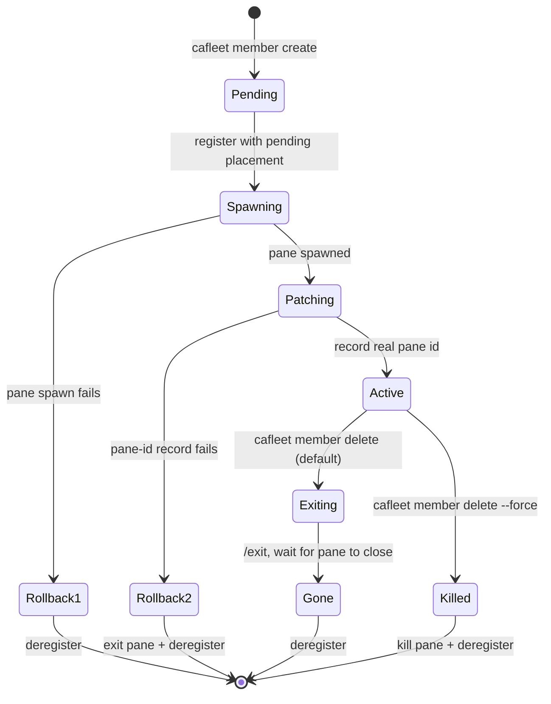

# Member lifecycle

The `cafleet member` CLI subgroup wraps the two-step "register an agent +
spawn a tmux pane" recipe behind a single command and persists the
agent-to-pane mapping in the `agent_placements` table.

**Terminology**: A "member" is an agent spawned by a Director via
`cafleet member create`. It has an associated placement row linking it to a
specific tmux pane, window, and session. The Director itself is NOT a member
— it registers with plain `cafleet agent register`.

**Single-Director invariant**: A fleet has exactly one Director — the root
Director recorded in `fleets.director_agent_id` at `fleet create` time. Only
that root Director may own members, so every member's
`agent_placements.director_agent_id` equals the fleet root. A member can never
be another member's Director: member registration rejects any placement whose
`director_agent_id` is not the fleet root. The team model is a single flat
tier; there is no team nesting.

## Lifecycle state diagram

## Atomic create flow

`cafleet member create` is atomic: it registers the member agent with a
pending placement (no pane id yet), spawns the member pane in the Director's
own tmux window, then patches the placement row with the real pane id. If the
spawn or the patch fails, the registration is rolled back. The new pane is
created without stealing focus, so the Director's active window is unchanged.

## Delete ordering

Default path: type `/exit` and submit it (separate keystrokes with short
settle gaps, so every backend's input line registers the command before
Enter), poll `list-panes` until the pane disappears (15 s timeout), then
deregister. On timeout, capture the pane tail and fail loudly with exit
code 2; the operator reruns with `--force` for an atomic kill+deregister.

## Spawn-prompt input modes

The spawn prompt is supplied inline (`-- "<prompt>"`) or via `--prompt-file`
(an absolute UTF-8 path) — see [CLI options](../spec/cli-options.md)
`member create`.

## Pane display name

Only the `claude` backend sets the tmux pane title to the member name — see
[Coding agents](coding-agents.md) for the asymmetry.

## Commands

`member create`, `member delete`, `member list` (with `--activity` for
per-member `last_sent` / `last_recv` / `last_ack` / `idle` aggregation),
`member capture`, `member send-input`, `member exec`, and `member ping`.
`member create` takes `--agent-id` (the spawning Director's ID, which must
equal the fleet root); the others target by `--member-id`, scoped to the
global `--fleet-id` — a `--member-id` outside the fleet returns "not found".
See [CLI options](../spec/cli-options.md) for every flag and the shared
member-resolution rules.

`cafleet member exec` is the bash-routing primitive — see
[Bash routing](bash-routing.md).
