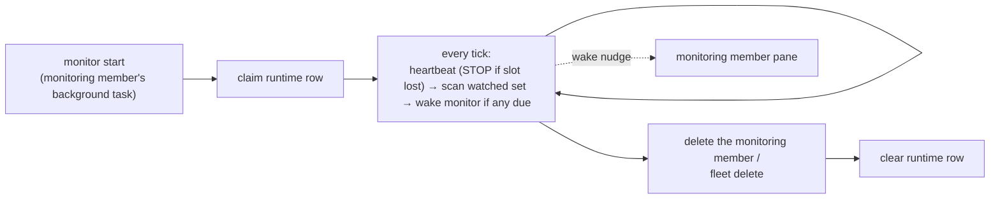

# Monitoring

`cafleet monitor` is a fleet-scoped foreground loop — `scan → wake → sleep` —
that the fleet's dedicated **monitoring member** runs as a background task in
its own pane. It supplies the **heartbeat** a Director needs to supervise its
team: a plain loop, not agent reasoning, that scans the **watched set** (the
root Director and every ordinary member, each on its own interval) and, when at
least one watched member is due, wakes the monitoring member once by keystroking
into its pane. While the loop runs it spends no model tokens, and because it is
just a backgrounded command it works identically on any backend. One monitor
and one monitoring member per fleet; there is no `monitor stop` — deleting the
monitoring member kills its pane and the loop terminates with it.

## Heartbeat vs facilitation

The loop decides only the *when*. The monitoring member classifies captures and
may perform one broker-authorized fixed action; task judgment stays with the
Director:

| Layer | Owns | Lives in |
|---|---|---|
| Heartbeat (the *when*) | which watched members are due; one synchronized wake into the monitoring member | the `cafleet monitor` loop |
| Fixed stall recovery | capture classification, durable stall observation, at-most-once fixed inbox-poll ping, aggregate report | the monitoring member plus broker state machine |
| Facilitation (the *what next*) | assignment judgment, task dispatch, health-check, recovery, escalation | the Director, per the cafleet skill's supervision protocol |

The loop's only keystroke is a **wake nudge** into the monitoring member's own
pane. It names each due member as
`<role> <id> (<sanitized-name>; coding_agent=<backend>) [<reasons>]` and carries
the Director descriptor. The tmux and herdr payloads are byte-identical. The
loop never keystrokes a watched pane; after capture-based broker resolution,
the monitoring member may separately invoke the unchanged fixed
`cafleet member ping` once for a confidently stalled ordinary member.

The facilitation layer's re-engagement is itself **capture-gated**: before the
Director fires a re-engagement keystroke at a member (`cafleet member ping`, a
non-exempt `cafleet message send`, or a `cafleet message broadcast`), it takes
a fresh read-only `cafleet member capture` of the target and classifies it on
the same five-state rubric the monitoring member uses, firing only on
`finished` or `stalled` — a pane classified `awaiting_user` or `working` has
its round skipped and the entire send deferred to a later facilitation tick.
The full gate is part of the cafleet skill's supervision protocol, which the
Director follows whenever it re-engages a member.

## The watched set

Enrollment is by member class:

| Member class | Enrolled | `monitor` field on `GET /api/members` |
|---|---|---|
| The fleet's root Director | yes | A schedule object |
| An ordinary member with a placement | yes | A schedule object |
| The dedicated monitoring member | no — it is the watcher | `null` |
| A deregistered member | no — the row is hard-deleted on deregistration | `null` |
| A registry row without a placement | no | `null` |

The root Director is checked far more often than an ordinary member; both
defaults live in the knob table under
[Cadence and tick precision](#cadence-and-tick-precision).

A watched member enters the due set only from a normal trigger. The scan order
is lifecycle reconciliation, `interval`, durable `stall-check`, native herdr
`status:done`, then `unacked` annotation. One synchronized wake carries the
complete union:

| Reason | Fires when | Advances `last_ping_at`? | Availability | Silenced by |
|---|---|---|---|---|
| `interval` | The member is enabled, its pane is alive, and its own interval has elapsed since `last_ping_at` | yes | Both backends | `cafleet monitor config --disable` |
| `unacked` | Annotation only: the already-due member's oldest un-acked delivery is at least its own interval old | no | Both backends | It never creates a due row |
| `stall-check` | The stall-check interval has elapsed since that pane's last stall-check wake | no | Both backends | `CAFLEET_MONITOR_STALL_INTERVAL=0`, or `cafleet monitor config --disable` |
| `status:done` | The member's native agent status transitions into `done` | yes | herdr only | `cafleet monitor config --disable` |

A stale un-acked delivery is context, not proof of a stall: it can annotate an
interval-, stall-check-, or native-due row, always last in the reason list, but
cannot add a row or wake the monitoring member. In particular,
`working + unacked` remains `working` and causes no action by itself. There is
no process-local unacked re-fire map.

On the **herdr** backend a watched member is additionally due when its native
agent status transitions into `done`; a transition into `blocked` (awaiting a
user answer) never wakes the watcher. This trigger augments, never replaces,
the interval trigger and does not exist on tmux — see
[Native agent-state](../spec/multiplexer-backends.md#native-agent-state).

## The monitoring member {#the-monitoring-member}

The monitoring member is a single, dedicated coding-agent member — spawned
first-in with `cafleet member create --role monitor` (the Director passes
`--model haiku`) — that launches `cafleet monitor start` as a background task
in its own pane and applies LLM judgment to the watched members' state. It is
identified by `member_card_json.cafleet.kind == "monitoring-member"`; a second
`--role monitor` spawn is rejected.

On each wake the monitoring member:

1. Captures every named pane and the Director at
   `--lines 120 --no-ansi --json`. Capture JSON includes `captured_at` and
   `content_sha256` of the exact emitted content. Each target's rendered
   `coding_agent` selects its own overlay cues.
2. Classifies content as `awaiting_user`, `unknown`, `finished`, `working`, or
   quiet `stall_candidate`. Any affirmative or ambiguous active-work cue is
   `working`; only the broker can resolve `stall_candidate` to `stalled`.
3. Reads durable `escalation_pending` rows, then submits ordinary observations
   to `monitor stall observe`. A first candidate seeds the durable baseline;
   only a byte-identical second candidate whose validated capture timestamp is
   a full stall interval later claims `nudge_claimed` and returns
   `action = ping`.
4. For that action only, invokes the fixed `cafleet member ping` once and
   records `monitor stall ping-result`. Success becomes `nudged`; failure
   becomes sticky `escalation_pending/ping_failed`. An unchanged next
   synchronized observation becomes
   `escalation_pending/unchanged_after_nudge`. Restart after a claim never
   repeats the ping and instead records `ping_interrupted`.
5. After ordinary actions, re-captures the Director and submits
   `--director-gate`. Only `finished` or broker-resolved `stalled` issues a
   fresh 30-second, single-use token backed by `monitor_director_gate`. It then calls `monitor report-batch`
   immediately with no intervening command. This is the sole Director-delivery
   path during a wake.

The aggregate is durable and bounded to one open message per fleet. Preview
retries reuse the same message ID; only Director ACK completes delivery. The
Director first retrieves the exact ID with `message show --full`, processes the
untruncated body, deduplicates by message ID, and ACKs once. `finished` remains
report-only: only the Director knows whether assigned work remains.

## Cadence and tick precision {#cadence-and-tick-precision}

| Knob | Default | Set by |
|---|---|---|
| Root Director ping interval | `180s` | `monitor_config.interval_seconds` (the Director's row) |
| Ordinary member ping interval | `720s` | `monitor_config.interval_seconds` (each member's row) |
| Stall-check interval | `240s` | `monitor_stall_interval` / `CAFLEET_MONITOR_STALL_INTERVAL` |
| Unacked-delivery annotation threshold | the member's own ping interval | `monitor_config.interval_seconds` (no independent trigger) |
| Scan tick | `5s` | `monitor start --tick N` (per run) |

The monitor scans once per **tick** and a member only comes due at a tick
boundary, so the tick is the floor on interval precision. Per-member intervals
are editable via `cafleet monitor config` or the admin WebUI.
`last_stall_check_at` is persisted separately from `last_ping_at`, so an
immediate monitor-loop restart honors the remaining stall cadence. The broker
also persists `last_stall_candidate_at` independently and rejects hash
promotion until two actual captures are a full interval apart. A failed watcher
wake commits neither dispatch timestamp. `CAFLEET_MONITOR_STALL_INTERVAL=0`
disables stall classification and therefore direct monitor pings. Unacked
staleness only controls whether the hint is appended to a normal due row.

## Single-instance and liveness

Exactly one monitor may run per fleet. The `monitor_runtime` DB row is the
single authority for both the single-instance claim (one SQLite write
transaction, so two concurrent `monitor start` calls cannot both win) and
liveness: the running loop rewrites `last_tick_at` every tick, so a monitor
that died silently reads as stale. Both the per-tick heartbeat and the on-exit
clear are ownership-checked — a displaced monitor's next heartbeat matches
zero rows and it self-terminates.

## Lifecycle

The monitoring member is spawned **first-in**: it launches the loop, confirms
with `cafleet monitor status`, and its `ready: monitor live` handshake gates
spawning ordinary members. Teardown is **first-out**: the Director deletes the
monitoring member before the ordinary members, and the loop terminates with its
pane; a runtime row the pane kill leaves behind is removed by `fleet delete`.
`fleet delete` alone also ends a still-running loop — its next tick sees the
soft-deleted fleet and self-terminates.

Per-member schedule and episode state (`interval_seconds`, `enabled`,
`last_ping_at`, `last_stall_check_at`, candidate timestamp/fingerprint,
episode state, and escalation reason) are persisted in `monitor_config`.
Disable/dead/pending-pane cleanup resets non-pending episodes, converts an
in-flight claim to sticky interruption escalation, and preserves pending
reports; soft deregistration explicitly deletes the row. See
[Data model](../spec/data-model.md) for the backing tables and
[CLI options](../spec/cli-options.md#cafleet-monitor) for the command surface.
