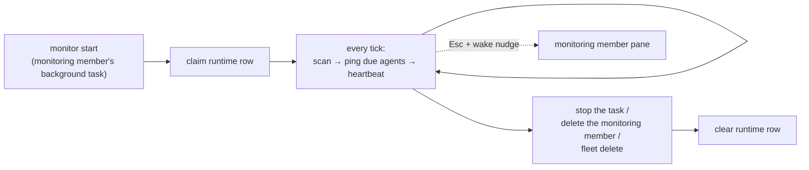

# Monitoring

`cafleet monitor` is a fleet-scoped foreground loop — `scan → ping → sleep` —
that the fleet's dedicated **monitoring member** runs as a **background task** in
its own pane. It supplies the **heartbeat** a Director needs to supervise its
team: a plain loop, not agent reasoning, that wakes **only** the monitoring
member on a fixed cadence by keystroking into its tmux pane. While the loop runs
it spends **no model tokens**, and because it is just
a backgrounded command it works identically on **any** backend (`claude`,
`codex`, `opencode`). `cafleet monitor start` runs the loop in-process; the
monitoring member owns its lifetime — there is no detached subprocess and no
`monitor stop` (stop the background task, or delete the monitoring member, to
stop it). One monitor per fleet, and one monitoring member per fleet.

Every keystroke the loop sends is **`Esc`-safeguarded**: it presses `Escape`
first, lets the pane settle for ~0.1 s, then types the literal text and `Enter`.
The leading `Esc` means a pane sitting on a pending permission-approval prompt
dismisses that prompt instead of having the trailing `Enter` confirm it — a
heartbeat keystroke can never blindly approve a coding agent's pending
permission request.

## Heartbeat vs facilitation

The monitor decides only the *when* — which agents are due and a keystroke to
wake them. It MUST NOT poll, ACK, dispatch work, health-check, or escalate;
those require agent judgment and stay the Director's job, defined by the
`cafleet-agent-team-supervision` skill (the *what*).

| Layer | Owns | Lives in |
|---|---|---|
| Heartbeat (the *when*) | which agents are due; the wake keystroke | the `cafleet monitor` loop |
| Facilitation (the *what*) | poll → ACK → dispatch → health-check → escalate | the Director, per the supervision skill |

The loop wakes only one role, the **monitoring member**, with an
`Esc`-safeguarded *wake nudge* — a single-line instruction to run its
capture-classify-reengage routine now. The loop runs inside the monitoring
member's own pane, so this wake is a deliberate self-ping that drives the routine
each tick (see [The monitoring member](#the-monitoring-member)).

The Director receives **no** keystroke from the loop. It is re-engaged only on
demand: by the monitoring member's idle nudge (an `Esc`-safeguarded
`cafleet message send` when the routine classifies the Director as idle) and by
the broker's inline-preview keystroke on every inbound `cafleet message send`.

The monitor never reasons about message content — it is the alarm clock; the
Director is the worker, and the monitoring member is the watcher that re-engages
a stalled Director on demand.

## Who gets pinged

Each tick, the monitor evaluates its enrolled, active agents and pings the ones
whose interval has elapsed. Enrollment is restricted to exactly one agent per
fleet: the **monitoring member**. The root Director is **not** enrolled, and
ordinary members are **not** enrolled — neither is ever pinged by the loop. The
Director is re-engaged on demand (the monitoring member's idle nudge, plus the
broker's inline-preview keystroke on every `cafleet message send`); re-engaging
a quiet member is always Director-mediated (the broker's inline-preview keystroke
on every `cafleet message send` is the primary member-wake path; the Director's
`Esc`-safeguarded `cafleet member ping` is the manual recovery path).

The monitoring member is pinged **unconditionally once due**, regardless of
whether it has any pending inbox items: each wake drives its capture-and-assess
routine. The re-ping is unbounded — no backoff, no cap.

`pending_count` (the count of an agent's un-acked inbox items) is still computed
and shown in `monitor status`, but it does not gate the ping — it is purely
informational.

A ping is skipped only when the agent is disabled, when its pane is missing or
dead, or when its interval has not yet elapsed. The loop wakes only the
monitoring member (with the wake nudge), so any other enrolled row — a
stray/legacy Director row that survived the prune, the Administrator, an ordinary
member — is defensively **skipped**, never woken.

Each dispatched ping is logged to the monitor's stdout as
`<iso-ts> ping agent <id> (<name>)`. Because `cafleet monitor start` runs in the
foreground of the monitoring member's background task, that task's output shows
live heartbeat activity, one line per ping.

## The monitoring member

The monitoring member is a single, dedicated coding-agent member — spawned with
`cafleet member create --role monitor` (the Director passes `--model sonnet`) —
that owns the heartbeat and applies LLM judgment to the Director's state. It is
identified by `agent_card_json.cafleet.kind == "monitoring-member"` (the same
`kind`-marker pattern the built-in Administrator uses; no new SQL column), and it
is the **one** process in the fleet that runs `cafleet monitor start`. There is
at most one monitoring member per fleet; a second `--role monitor` spawn is
rejected.

On each `Esc`-safeguarded wake the loop keystrokes into its own pane, the
monitoring member runs its routine:

1. **Capture the Director's pane** via `cafleet member capture --member-id
   <director-id>` (read-only; `member capture` accepts any in-fleet agent with a
   placement, the root Director included).
2. **Classify the Director active vs idle** with its own judgment.
   - **ACTIVE** → do nothing.
   - **IDLE** → assess the full picture (the Director's inbox state, its current
     task, and ordinary members' panes via read-only `cafleet member capture`),
     then **re-engage the Director** with a concise `Esc`-safeguarded nudge via
     `cafleet message send --to <director-id>` summarizing what needs attention
     (un-ACKed inbox items, stalled members).

The monitoring member **never** keystrokes ordinary members with task
instructions — all member-driving routes back through the Director, who owns the
whole task. A member that has gone quiet is surfaced to the Director by the
monitoring member's idle assessment; the Director then re-pings it (via
`cafleet member ping`) or re-sends the instruction.

Because the monitoring member is itself enrolled, the loop running inside its
pane keystrokes the wake nudge into that same pane's foreground — a deliberate
self-ping. The leading `Esc` will interrupt the monitoring member's own
in-progress turn if a wake lands mid-routine; because the ping interval (default
60 s) is far longer than a routine's duration, the overlap is rare and the
self-interrupt is accepted.

## Cadence and tick precision

| Knob | Default | Set by |
|---|---|---|
| Per-agent ping interval | `60s` | `monitor_config.interval_seconds` (per agent) |
| Scan tick | `5s` | `monitor start --tick N` (per run) |

The monitor scans once per **tick** and pings each agent whose **interval** has
elapsed since its last ping. Because a ping only comes due at a tick boundary,
**the tick is the floor on interval precision**: an interval that is not a
multiple of the tick snaps up to the next tick boundary (e.g. a 7 s interval
under a 5 s tick fires at ~10 s). Set the tick smaller than the smallest
interval you care about.

## Single-instance and liveness

Exactly one monitor may run per fleet. The **`monitor_runtime` DB row is the
single authority** for both single-instance coordination and `status` liveness
— there is no PID file and no state directory. The single-instance claim runs in
one SQLite write transaction, so two concurrent `monitor start` calls cannot
both win.

**Liveness is read from the DB heartbeat**, not from the process table: the
running monitor rewrites `last_tick_at` every tick, so a monitor that died
silently is detected as stale (`now - last_tick_at` exceeds the stale window)
even though nothing cleaned up after it. `os.kill(pid, 0)` is a corroborating
signal, not the authority.

Because a stale heartbeat is treated as dead, a fresh `start` may reclaim the
slot from a momentarily-wedged monitor. To keep two live monitors from both
pinging, the slot has exactly one owner (the pid that claimed it) and both the
per-tick heartbeat and the on-exit clear are **ownership-checked**: a displaced
monitor's next heartbeat matches zero rows, so it self-terminates without
pinging and without wiping the winner's row.

## Lifecycle

- **Spawned first.** The monitoring member is the **first** `member create` in
  the fleet (first-in). After it boots it launches `cafleet monitor start --fleet-id N` as a **background task** in its own pane, confirms with `cafleet monitor
  status`, and reports `ready: monitor live` to the Director. Receipt of that
  handshake message is the gate for spawning ordinary members — this is the only
  `monitor start` in the fleet; the Director no longer runs it. The loop inherits
  the monitoring member's pane environment (`$TMUX`, `$CAFLEET_DATABASE_URL`) and
  fails fast on startup if it cannot reach a tmux session.
- **Run**: each tick scans the enrolled monitoring member, wakes it with the
  `Esc`-safeguarded wake nudge when due, and rewrites the heartbeat.
- **Stop (first-out).** Teardown stops the monitor **before** the monitoring
  member's pane is killed: the Director messages the monitoring member to stop
  its `monitor start` background task (the task-stop delivers SIGTERM/SIGINT, so
  the loop runs its `finally` and clears the runtime row), the monitoring member
  confirms, and only then does the Director `cafleet member delete` it — first,
  before the ordinary members. A hard pane-kill instead leaves the heartbeat to
  go stale, after which `status` reports stopped (the accepted degraded path).
  There is no `monitor stop` command. `fleet delete` needs no stop step — a
  running loop's next tick sees the soft-deleted fleet and self-terminates, and
  `delete_fleet` removes the `monitor_runtime` + `monitor_config` rows.

Per-agent schedule (`interval_seconds`, `enabled`) is persisted, so cadence
resumes from `last_ping_at` across a restart. The schedule is editable from both
the CLI (`cafleet monitor config`) and the admin WebUI at parity; launching and
stopping the loop is CLI-only by nature (it is the monitoring member's background
task).

## Enrollment and schema

Two tables back the monitor. Both reuse a parent id as a 1:1 INTEGER primary key
(no fresh sequence), and both are cleaned explicitly on teardown.

- **`monitor_config`** — one row per **enrolled** agent, holding its
  `interval_seconds`, `last_ping_at`, and `enabled` flag. Enrollment is
  restricted to exactly one agent per fleet: the monitoring member (enrolled when
  `register_agent` sees `kind == "monitoring-member"`). The root Director is
  **not** enrolled, nor are ordinary members, the write-only Administrator, or
  card-only agents. `is_director` is still *derived* at scan time
  (`agent_id == fleets.director_agent_id`) purely for the loop's defensive skip
  and `monitor status` labeling — a Director row is not expected — and the
  monitoring member is *derived* from `agent_card_json.cafleet.kind`; neither is
  denormalized.
- **`monitor_runtime`** — one row per fleet, holding the running loop's `pid`,
  `started_at`, `last_tick_at` heartbeat, and `tick_seconds`. "No monitor" is
  modeled cleanly as "no row".

Two one-shot Alembic data migrations bring an upgraded database to the new
`{monitoring member}`-only enrollment world. `0003` pruned every non-Director
`monitor_config` row (leaving the root-Director rows), and `0004` then prunes
those root-Director rows, so after both run `monitor_config` holds only
monitoring-member rows. Both downgrades are no-ops.

See [Data model](../spec/data-model.md) for the full column definitions and the
[CLI options](../spec/cli-options.md#cafleet-monitor) page for the
`cafleet monitor` command surface.
