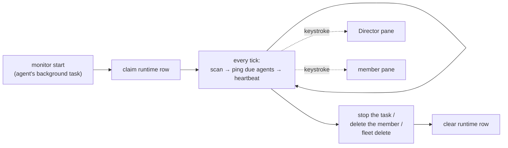

# Monitoring

`cafleet monitor` is a fleet-scoped foreground loop — `scan → ping → sleep` —
that a coding agent runs as a **background task** (the Director's own background
task, or a dedicated monitoring member). It supplies the **heartbeat** a
Director needs to supervise its team: a plain loop, not agent reasoning, that
wakes due agents on a fixed cadence by keystroking `cafleet … message poll` into
their tmux panes. While the loop runs it spends **no model tokens**, and because
it is just a backgrounded command it works identically on **any** backend
(`claude`, `codex`, `opencode`). `cafleet monitor start` runs the loop
in-process; the launching agent owns its lifetime — there is no detached
subprocess and no `monitor stop` (stop the background task, or delete the
monitoring member, to stop it). One monitor per fleet.

## Heartbeat vs facilitation

The monitor decides only the *when* — which agents are due and a keystroke to
wake them. It MUST NOT poll, ACK, dispatch work, health-check, or escalate;
those require agent judgment and stay the Director's job, defined by the
`cafleet-agent-team-supervision` skill (the *what*).

| Layer | Owns | Lives in |
|---|---|---|
| Heartbeat (the *when*) | which agents are due; the wake keystroke | the `cafleet monitor` loop |
| Facilitation (the *what*) | poll → ACK → dispatch → health-check → escalate | the Director, per the supervision skill |

Pinging an agent keystrokes *exactly* `cafleet … message poll` into its pane
(the fixed poll-trigger payload — the monitor cannot inject a richer prompt). A
bare poll, on its own, performs only the first step of facilitation. The
contract that makes a woken Director run its full facilitation loop therefore
lives in the supervision skill, not in the keystroke: **a monitor poll-trigger
wake is the Director's cue to run its entire facilitation loop**, not to read
its inbox and stop. The monitor never reasons about message content — it is the
alarm clock; the Director is the worker.

## Who gets pinged

Each tick, the monitor evaluates every enrolled, active agent and pings the ones
whose interval has elapsed. **Both roles — the root Director and every member —
are pinged unconditionally once due**, regardless of whether the agent has any
pending inbox items. The Director's facilitation does useful work even on an
empty inbox (it still health-checks members, dispatches queued work, and detects
stalls); pinging an idle member re-drains its inbox and keeps the heartbeat
visible. The re-ping is unbounded — no backoff, no cap.

`pending_count` (the count of an agent's un-acked inbox items) is still computed
and shown in `monitor status`, but it no longer gates the ping — it is purely
informational.

A ping is skipped only when the agent is disabled, when its pane is missing or
dead, or when its interval has not yet elapsed.

Each dispatched ping is logged to the monitor's stdout as
`<iso-ts> ping agent <id> (<name>)`. Because `cafleet monitor start` runs in the
foreground of the launching agent's background task, that task's output shows
live heartbeat activity, one line per ping.

## Cadence and tick precision

| Knob | Default | Set by |
|---|---|---|
| Per-agent ping interval | `60s` | `monitor_config.interval_seconds` (per agent) |
| Scan tick | `5s` | `monitor start --tick N` (per run) |

The monitor scans once per **tick** and pings each agent whose **interval** has
elapsed since its last ping. Because a ping only comes due at a tick boundary,
**the tick is the floor on interval precision**: an interval that is not a
multiple of the tick snaps up to the next tick boundary (e.g. a 7 s interval
under a 5 s tick fires at ~10 s). Set the tick smaller than the smallest
interval you care about.

## Single-instance and liveness

Exactly one monitor may run per fleet. The **`monitor_runtime` DB row is the
single authority** for both single-instance coordination and `status` liveness
— there is no PID file and no state directory. The single-instance claim runs in
one SQLite write transaction, so two concurrent `monitor start` calls cannot
both win.

**Liveness is read from the DB heartbeat**, not from the process table: the
running monitor rewrites `last_tick_at` every tick, so a monitor that died
silently is detected as stale (`now - last_tick_at` exceeds the stale window)
even though nothing cleaned up after it. `os.kill(pid, 0)` is a corroborating
signal, not the authority.

Because a stale heartbeat is treated as dead, a fresh `start` may reclaim the
slot from a momentarily-wedged monitor. To keep two live monitors from both
pinging, the slot has exactly one owner (the pid that claimed it) and both the
per-tick heartbeat and the on-exit clear are **ownership-checked**: a displaced
monitor's next heartbeat matches zero rows, so it self-terminates without
pinging and without wiping the winner's row.

## Lifecycle

- **Start**: a coding agent runs `cafleet --fleet-id N monitor start` as a
  **background task**. The loop runs in-process and inherits the launching pane's
  environment (`$TMUX`, `$CAFLEET_DATABASE_URL`); it fails fast on startup if it
  cannot reach a tmux session. There is no detached subprocess.
- **Run**: each tick scans the fleet's enrolled agents, pings the due ones, and
  rewrites the heartbeat.
- **Stop**: the launching agent stops the background task (or deletes the
  monitoring member). A clean stop (SIGTERM/SIGINT) clears the runtime row; a
  hard kill simply lets the heartbeat go stale, after which `status` reports
  stopped. There is no `monitor stop` command. `fleet delete` needs no stop step
  — a running loop's next tick sees the soft-deleted fleet and self-terminates,
  and `delete_fleet` removes the `monitor_runtime` + `monitor_config` rows.

Per-agent schedule (`interval_seconds`, `enabled`) is persisted, so cadence
resumes from `last_ping_at` across a restart. The schedule is editable from both
the CLI (`cafleet monitor config`) and the admin WebUI at parity; launching and
stopping the loop is CLI-only by nature (it is the agent's background task).

## Enrollment and schema

Two tables back the monitor. Both reuse a parent id as a 1:1 INTEGER primary key
(no fresh sequence), and both are cleaned explicitly on teardown.

- **`monitor_config`** — one row per **pane-bound** agent, holding its
  `interval_seconds`, `last_ping_at`, and `enabled` flag. A row is inserted
  automatically at registration for every agent that has a tmux pane (the root
  Director and every member); the write-only Administrator and card-only agents
  have no pane and are not enrolled. Director-vs-member is *derived* at scan time
  (`agent_id == fleets.director_agent_id`), not stored.
- **`monitor_runtime`** — one row per fleet, holding the running loop's `pid`,
  `started_at`, `last_tick_at` heartbeat, and `tick_seconds`. "No monitor" is
  modeled cleanly as "no row".

See [Data model](../spec/data-model.md) for the full column definitions and the
[CLI options](../spec/cli-options.md#cafleet-monitor) page for the
`cafleet monitor` command surface.
