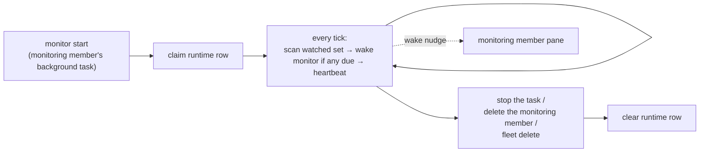

# Monitoring

`cafleet monitor` is a fleet-scoped foreground loop — `scan → wake → sleep` —
that the fleet's dedicated **monitoring member** runs as a **background task** in
its own pane. It supplies the **heartbeat** a Director needs to supervise its
team: a plain loop, not agent reasoning, that scans the **watched set** (the root
Director and every ordinary member, each on its own interval) and, when at least
one watched agent is due, wakes the monitoring member once by keystroking into
its tmux pane. While the loop runs it spends **no model tokens**, and because it
is just a backgrounded command it works identically on **any** backend (`claude`,
`codex`, `opencode`). `cafleet monitor start` runs the loop in-process; the
monitoring member owns its lifetime — there is no detached subprocess and no
`monitor stop` (stop the background task, or delete the monitoring member, to
stop it). One monitor per fleet, and one monitoring member per fleet.

The `Esc` safeguard lives wherever a keystroke's target pane **may** be parked
on a pending permission-approval prompt. Two such paths exist: the
**message-delivery inline preview** (every inbound `cafleet message send` /
`broadcast` / `cafleet member nudge`, whose recipient — including a Director — may
be sitting on a prompt) and `cafleet member ping`. Both press `Escape` first, let
the pane settle for ~0.1 s, then type the literal text and `Enter`, so the
trailing `Enter` dismisses a pending prompt instead of blindly confirming it.

The monitor loop's own **wake nudge** is the exception: it keystrokes only into
the monitoring member's own pane, which runs a read-only routine under `dontAsk`
and is never parked on a permission prompt, so the wake nudge does **not** lead
with `Esc` (a leading `Esc` there would only self-interrupt an in-progress
routine). The safeguard is applied where a prompt may exist and omitted where one
never does.

## Heartbeat vs facilitation

The monitor decides only the *when* — which watched agents are due and a single
keystroke to wake the monitoring member. It MUST NOT poll, ACK, dispatch work,
health-check, or escalate; those require agent judgment and stay the Director's
job, defined by the `cafleet-agent-team-supervision` skill (the *what*).

| Layer | Owns | Lives in |
|---|---|---|
| Heartbeat (the *when*) | which watched agents are due; the wake keystroke into the monitoring member | the `cafleet monitor` loop |
| Facilitation (the *what*) | poll → ACK → dispatch → health-check → escalate | the Director, per the supervision skill |

The loop's only keystroke is a *wake nudge* (the `send_wake_trigger` helper) into
the monitoring member's own pane — a single-line instruction to run its
capture-classify-reengage routine now. The loop fires that wake when **≥ 1
watched agent** (the Director or an ordinary member) has come due, and the nudge
**names** each freshly-due agent as `<role> <id> (<name>)` (role `director` or
`member`) plus the Director id as the standing inspect-and-re-engage target, so
the monitoring member inspects exactly those named panes plus the Director this
wake. The loop runs inside the monitoring member's own pane, so this wake lands
in that same pane's foreground (see [The monitoring member](#the-monitoring-member)).
The wake nudge does not lead with `Esc` — `send_wake_trigger` does not pass
`esc_first`, because the monitoring member's pane is never on a permission prompt.

The Director receives **no** keystroke from the loop. It is re-engaged only on
demand: by the monitoring member's idle nudge — `cafleet member nudge`, which
persists an ACKable broker task carrying the summary **and** fires the hardened,
`Esc`-safeguarded inline preview — and by the broker's inline-preview keystroke
on every inbound `cafleet message send`.

The monitor never reasons about message content — it is the alarm clock; the
Director is the worker, and the monitoring member is the watcher that inspects
each freshly-due agent and re-engages a stalled Director on demand.

## The watched set

Each tick, the monitor evaluates its enrolled, active agents — the **watched
set** — and flags the ones whose interval has elapsed. Enrollment covers the
**root Director** (default **180 s**) and **every ordinary member** (default
**720 s**), each carrying its own per-agent interval. The dedicated monitoring
member is **not** enrolled: it is the *watcher*, not a watched agent (see
[The monitoring member](#the-monitoring-member)). The write-only Administrator and
card-only agents are never enrolled.

When ≥ 1 watched agent is due, the loop wakes the monitoring member **once** and
stamps `last_ping_at = now` on each due agent. That stamp advances each watched
agent's cadence, so a just-flagged agent is not due again on the next tick — this
prevents a wake-storm while the watcher is still working. `last_ping_at` means
"the last time the monitor dispatched a check for this agent."

The loop **never keystrokes a watched pane.** Its only keystroke is the wake
nudge into the watcher's own pane. Re-engaging the Director — or surfacing a quiet
member — is always Director-mediated (the monitoring member's `cafleet member
nudge` for the Director; the broker's inline-preview keystroke on every
`cafleet message send`, and the Director's `Esc`-safeguarded `cafleet member ping`,
for a member).

`pending_count` (the count of an agent's un-acked inbox items) is still computed
and shown in `monitor status`, but it does not gate anything — it is purely
informational.

A watched agent is flagged only when it is enabled, its pane is alive, and its
interval has elapsed since its last wake-dispatch; otherwise it is skipped.

Each wake-dispatch is logged to the monitor's stdout as
`<iso-ts> due agent <id> (<name>) -> wake monitor`, one line per due agent.
Because `cafleet monitor start` runs in the foreground of the monitoring member's
background task, that task's output shows live heartbeat activity. If there is
**no** monitoring member (or its pane is dead), the loop records nothing and
simply continues — there is no one to wake.

## The monitoring member

The monitoring member is a single, dedicated coding-agent member — spawned with
`cafleet member create --role monitor` (the Director passes `--model haiku`) —
that owns the heartbeat and applies LLM judgment to the watched agents' state.
Because `--coding-agent` is omitted on this spawn, the monitoring member
inherits the spawning Director's backend (from the Director's placement row)
rather than defaulting to `claude`, so it runs on — and reads the overlay of —
the same backend it watches; an explicit `--coding-agent` still wins. It
is identified by `agent_card_json.cafleet.kind == "monitoring-member"` (the same
`kind`-marker pattern the built-in Administrator uses; no new SQL column) and is
located by the broker's `find_monitoring_member` lookup (the kind marker joined to
its placement) — **not** by a `monitor_config` row, since the monitoring member is
never enrolled. It is the **one** process in the fleet that runs
`cafleet monitor start`. There is at most one monitoring member per fleet; a
second `--role monitor` spawn is rejected.

On each wake the loop keystrokes a nudge **naming the freshly-due agents** into
its own pane, and the monitoring member runs its routine — staying within two
read/act commands, read-only `cafleet member capture` and `cafleet member nudge`:

1. **Read the freshly-due agents named in the wake nudge** — each rendered as
   `<role> <id> (<name>)`. Those agents, plus the Director, are who you inspect
   this wake. (`cafleet monitor status` is available as optional context — e.g. to
   read intervals or pending counts — but it is **not** the source of the due set;
   the nudge's named list is authoritative.)
2. **Capture each named due agent's pane** via `cafleet member capture --member-id
   <id>` (read-only; `member capture` accepts any in-fleet agent with a placement,
   the root Director included) and judge it active/idle and progressing/stalled.
3. **Always also capture the Director's pane** via `cafleet member capture
   --member-id <director-id>` and classify it ACTIVE vs IDLE — the Director is the
   only actuation target. (If the Director is itself among the named due agents,
   step 2 already captured it; step 3 only adds the Director when it is not in the
   named list.)
4. **Re-engage the Director** via `cafleet member nudge --member-id <director-id>`
   when the Director is idle with un-ACKed inbox / stalled members, **or** when
   any named due agent looks stalled — naming what needs attention (idle
   Director, stalled member `<id>`). `member nudge` persists an ACKable broker
   task and fires the hardened, `Esc`-safeguarded inline preview into the
   Director's pane. The Director then drives the stalled member.

The monitoring member's *observation* spans the Director **and** every freshly-due
member, but its *actuation* is **Director-only**: it **never** keystrokes ordinary
members with task instructions — all member-driving routes back through the
Director, who owns the whole task. A member that looks stalled is surfaced to the
Director by the monitoring member's assessment; the Director then re-pings it (via
`cafleet member ping`) or re-sends the instruction.

Because the monitoring member runs the loop in its own pane, the wake nudge lands
in that same pane's foreground — a deliberate self-ping. The wake nudge does
**not** lead with `Esc` (the monitoring member's pane is never on a permission
prompt), so a wake landing mid-routine does not interrupt the monitoring member's
own in-progress turn.

## Cadence and tick precision

| Knob | Default | Set by |
|---|---|---|
| Root Director ping interval | `180s` | `monitor_config.interval_seconds` (the Director's row) |
| Ordinary member ping interval | `720s` | `monitor_config.interval_seconds` (each member's row) |
| Scan tick | `5s` | `monitor start --tick N` (per run) |

The monitor scans once per **tick** and flags each watched agent whose
**interval** has elapsed since its last wake-dispatch. Because an agent only comes
due at a tick boundary, **the tick is the floor on interval precision**: an
interval that is not a multiple of the tick snaps up to the next tick boundary
(e.g. a 7 s interval under a 5 s tick fires at ~10 s). Set the tick smaller than
the smallest interval you care about. Each interval is editable per agent
(`cafleet monitor config` or the admin WebUI), so the 180 s / 720 s defaults are
just the enrollment seeds.

## Single-instance and liveness

Exactly one monitor may run per fleet. The **`monitor_runtime` DB row is the
single authority** for both single-instance coordination and `status` liveness
— there is no PID file and no state directory. The single-instance claim runs in
one SQLite write transaction, so two concurrent `monitor start` calls cannot
both win.

**Liveness is read from the DB heartbeat**, not from the process table: the
running monitor rewrites `last_tick_at` every tick, so a monitor that died
silently is detected as stale (`now - last_tick_at` exceeds the stale window)
even though nothing cleaned up after it. `os.kill(pid, 0)` is a corroborating
signal, not the authority.

Because a stale heartbeat is treated as dead, a fresh `start` may reclaim the
slot from a momentarily-wedged monitor. To keep two live monitors from both
pinging, the slot has exactly one owner (the pid that claimed it) and both the
per-tick heartbeat and the on-exit clear are **ownership-checked**: a displaced
monitor's next heartbeat matches zero rows, so it self-terminates without
pinging and without wiping the winner's row.

## Lifecycle

- **Spawned first.** The monitoring member is the **first** `member create` in
  the fleet (first-in). After it boots it launches `cafleet monitor start --fleet-id N` as a **background task** in its own pane, confirms with `cafleet monitor
  status`, and reports `ready: monitor live` to the Director. Receipt of that
  handshake is the gate for spawning ordinary members — this is the only
  `monitor start` in the fleet; the Director no longer runs it. The loop inherits
  the monitoring member's pane environment (`$TMUX`, `$CAFLEET_DATABASE_URL`) and
  fails fast on startup if it cannot reach a tmux session.
- **Run**: each tick scans the watched set (Director + members), wakes the
  monitoring member with the wake nudge when ≥ 1 watched agent is due, stamps the
  due agents' `last_ping_at`, and rewrites the heartbeat.
- **Stop (first-out).** Teardown stops the monitor **before** the monitoring
  member's pane is killed: the Director messages the monitoring member to stop
  its `monitor start` background task (the task-stop delivers SIGTERM/SIGINT, so
  the loop runs its `finally` and clears the runtime row), the monitoring member
  confirms, and only then does the Director `cafleet member delete` it — first,
  before the ordinary members. A hard pane-kill instead leaves the heartbeat to
  go stale, after which `status` reports stopped (the accepted degraded path).
  There is no `monitor stop` command. `fleet delete` needs no stop step — a
  running loop's next tick sees the soft-deleted fleet and self-terminates, and
  `delete_fleet` removes the `monitor_runtime` + `monitor_config` rows.

Per-agent schedule (`interval_seconds`, `enabled`) is persisted, so cadence
resumes from `last_ping_at` across a restart. The schedule is editable from both
the CLI (`cafleet monitor config`) and the admin WebUI at parity; launching and
stopping the loop is CLI-only by nature (it is the monitoring member's background
task).

## Enrollment and schema

Two tables back the monitor. Both reuse a parent id as a 1:1 INTEGER primary key
(no fresh sequence), and both are cleaned explicitly on teardown.

- **`monitor_config`** — one row per **enrolled** agent, holding its
  `interval_seconds`, `last_ping_at`, and `enabled` flag. Enrollment covers the
  **root Director** (180 s, enrolled in `create_fleet` after its placement is
  added) and **every ordinary member** (720 s, enrolled in `register_agent` when
  it has a placement and is not the monitoring member). The dedicated monitoring
  member is **not** enrolled (it is the watcher, located by kind via
  `find_monitoring_member`); neither are the write-only Administrator or card-only
  agents. `is_director` is *derived* at scan time
  (`agent_id == fleets.director_agent_id`) for `monitor status` role labeling; it
  is not denormalized.
- **`monitor_runtime`** — one row per fleet, holding the running loop's `pid`,
  `started_at`, `last_tick_at` heartbeat, and `tick_seconds`. "No monitor" is
  modeled cleanly as "no row".

The one-shot Alembic data migration `0005` brings an upgraded database to the
inverted enrollment world: it deletes the monitoring member's `monitor_config`
rows and backfills every existing active root Director (180 s) and ordinary member
(720 s). A live fleet therefore picks up the new watched set on `cafleet db init`
without losing its heartbeat. The downgrade is a no-op.

See [Data model](../spec/data-model.md) for the full column definitions and the
[CLI options](../spec/cli-options.md#cafleet-monitor) page for the
`cafleet monitor` command surface.
