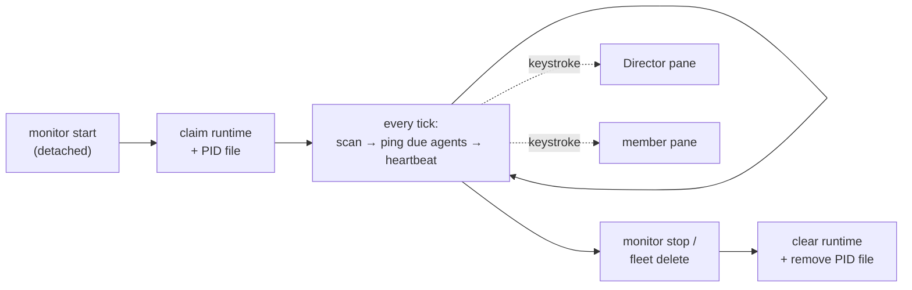

# Monitoring

`cafleet monitor` is a detached, fleet-scoped background process that supplies
the **heartbeat** a Director needs to supervise its team. It is a plain Python
loop — not a coding agent — that wakes due agents on a fixed cadence by
keystroking `cafleet … message poll` into their tmux panes. One monitor per
fleet, started with a single shell command from the Director's pane, gives a
Director on **any** backend (`claude`, `codex`, `opencode`) the same supervision
tick.

## Heartbeat vs facilitation

The monitor decides only the *when* — which agents are due and a keystroke to
wake them. It MUST NOT poll, ACK, dispatch work, health-check, or escalate;
those require agent judgment and stay the Director's job, defined by the
`cafleet-agent-team-supervision` skill (the *what*).

| Layer | Owns | Lives in |
|---|---|---|
| Heartbeat (the *when*) | which agents are due; the wake keystroke | `cafleet monitor` process |
| Facilitation (the *what*) | poll → ACK → dispatch → health-check → escalate | the Director, per the supervision skill |

Pinging an agent keystrokes *exactly* `cafleet … message poll` into its pane
(the fixed poll-trigger payload — the monitor cannot inject a richer prompt). A
bare poll, on its own, performs only the first step of facilitation. The
contract that makes a woken Director run its full facilitation loop therefore
lives in the supervision skill, not in the keystroke: **a monitor poll-trigger
wake is the Director's cue to run its entire facilitation loop**, not to read
its inbox and stop. The monitor never reasons about message content — it is the
alarm clock; the Director is the worker.

## The `should_ping` split

Each tick, the monitor evaluates every enrolled, active agent and pings only
those that are due:

- **The root Director pings unconditionally** on its interval. Its facilitation
  does useful work even on an empty inbox — it still health-checks members,
  dispatches queued work, and detects stalls.
- **A member pings only with a reason** — that is, only when it has pending
  un-acked inbox items. A periodic ping into an idle, empty-inbox member is pure
  noise and risks interrupting mid-work. The re-ping is unbounded: as long as a
  stuck member still has pending items and its interval has elapsed, it is
  pinged every interval, with no backoff and no cap. It self-clears the moment
  the member acks (its pending count drops to zero).

A ping is also skipped when the agent is disabled, or when its pane is missing
or dead.

## Cadence and tick precision

| Knob | Default | Set by |
|---|---|---|
| Per-agent ping interval | `60s` | `monitor_config.interval_seconds` (per agent) |
| Scan tick | `5s` | `monitor start --tick N` (per run) |

The monitor scans once per **tick** and pings each agent whose **interval** has
elapsed since its last ping. Because a ping only comes due at a tick boundary,
**the tick is the floor on interval precision**: an interval that is not a
multiple of the tick snaps up to the next tick boundary (e.g. a 7 s interval
under a 5 s tick fires at ~10 s). Set the tick smaller than the smallest
interval you care about.

## Single-instance, liveness, and the PID file

Exactly one monitor may run per fleet. Two artifacts enforce and report that,
with non-overlapping roles:

| Artifact | Role |
|---|---|
| `monitor_runtime` DB row | Authoritative coordination + liveness record. The atomic single-instance claim and `status` liveness derive from it. |
| PID file (`<state_dir>/<fleet_id>.pid`) | The conventional OS handle. Written at claim, removed at clean shutdown; the primary signal source for `stop`. |

The single-instance claim runs in one SQLite write transaction, so two
concurrent `monitor start` calls cannot both win. **Liveness is read from the DB
heartbeat**, not from the process table: the running monitor rewrites
`last_tick_at` every tick, so a monitor that died silently is detected as stale
(`now - last_tick_at` exceeds the stale window) even though nothing cleaned up
its PID file. `os.kill(pid, 0)` is a corroborating signal, not the authority.

Because a stale heartbeat is treated as dead, a fresh `start` may reclaim the
slot from a momentarily-wedged monitor. To keep two live monitors from both
pinging, the slot has exactly one owner (the pid that claimed it) and both the
per-tick heartbeat and the on-exit clear are **ownership-checked**: a displaced
monitor's next heartbeat matches zero rows, so it self-terminates without
pinging and without wiping the winner's row. The state directory defaults to
`~/.local/share/cafleet/monitor/` and is configurable via
`CAFLEET_MONITOR_STATE_DIR`.

## Lifecycle

- **Start** (`cafleet monitor start --fleet-id N`) spawns a detached worker and
  returns control to the caller's turn immediately. `--foreground` runs the
  identical loop in the current pane for debugging. The process inherits the
  launching pane's environment (`$TMUX`, `$CAFLEET_DATABASE_URL`) and fails fast
  if it cannot reach a tmux session.
- **Run**: each tick scans the fleet's enrolled agents, pings the due ones, and
  rewrites the heartbeat.
- **Stop** (`cafleet monitor stop --fleet-id N`) signals the process to shut
  down cleanly; `fleet delete` stops the monitor before soft-deleting the fleet.
  Both are idempotent.

Per-agent schedule (`interval_seconds`, `enabled`) is persisted, so cadence
resumes from `last_ping_at` across a restart. The schedule is editable from both
the CLI (`cafleet monitor config`) and the admin WebUI at parity; process
lifecycle (`start` / `stop`) is CLI-only.

## Enrollment and schema

Two tables back the monitor. Both reuse a parent id as a 1:1 INTEGER primary key
(no fresh sequence), and both are cleaned explicitly on teardown.

- **`monitor_config`** — one row per **pane-bound** agent, holding its
  `interval_seconds`, `last_ping_at`, and `enabled` flag. A row is inserted
  automatically at registration for every agent that has a tmux pane (the root
  Director and every member); the write-only Administrator and card-only agents
  have no pane and are not enrolled. Director-vs-member is *derived* at scan time
  (`agent_id == fleets.director_agent_id`), not stored.
- **`monitor_runtime`** — one row per fleet, holding the running worker's `pid`,
  `started_at`, `last_tick_at` heartbeat, and `tick_seconds`. "No monitor" is
  modeled cleanly as "no row".

See [Data model](../spec/data-model.md) for the full column definitions and the
[CLI options](../spec/cli-options.md#cafleet-monitor) page for the
`cafleet monitor` command surface.
