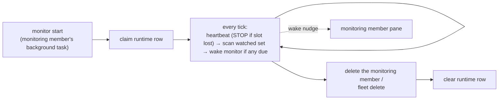

# Monitoring

`cafleet monitor` is a fleet-scoped foreground loop — `scan → wake → sleep` —
that the fleet's dedicated **monitoring member** runs as a background task in
its own pane. It supplies the **heartbeat** a Director needs to supervise its
team: a plain loop, not agent reasoning, that scans the **watched set** (the
root Director and every ordinary member, each on its own interval) and, when at
least one watched member is due, wakes the monitoring member once by keystroking
into its pane. While the loop runs it spends no model tokens, and because it is
just a backgrounded command it works identically on any backend. One monitor
and one monitoring member per fleet; there is no `monitor stop` — deleting the
monitoring member kills its pane and the loop terminates with it.

## Heartbeat vs facilitation

The monitor decides only the *when*. Everything requiring agent judgment stays
the Director's job, defined in the `/cafleet` skill's
`reference/supervision.md`:

| Layer | Owns | Lives in |
|---|---|---|
| Heartbeat (the *when*) | which watched members are due; the wake keystroke into the monitoring member | the `cafleet monitor` loop |
| Facilitation (the *what*) | poll → ACK → dispatch → health-check → escalate | the Director, per `/cafleet` `reference/supervision.md` |

The loop's only keystroke is a **wake nudge** into the monitoring member's own
pane, naming each due member as `<role> <id> (<name>) [<reasons>]` (reasons:
`interval`, `status:done`, `stall-check`) plus the Director as the standing
inspect target. It never keystrokes a watched pane, and because the monitoring
member's pane is never parked on a permission prompt, the wake nudge does not
lead with `Esc` — unlike the message-delivery preview and `cafleet member ping`
(see [Push notifications](../spec/multiplexer-backends.md#esc-safeguard)).

The facilitation layer's re-engagement is itself **capture-gated**: before the
Director fires a re-engagement keystroke at a member (`cafleet member ping`, a
non-exempt `cafleet message send`, or a `cafleet message broadcast`), it takes
a fresh read-only `cafleet member capture` of the target and classifies it on
the same five-state rubric the monitoring member uses, firing only on
`finished` or `stalled` — a pane classified `awaiting_user` or `working` has
its round skipped and the entire send deferred to a later facilitation tick.
The full gate lives in the `/cafleet` skill's `reference/supervision.md`.

## The watched set

Enrollment covers the **root Director** (default interval **180 s**) and
**every ordinary member** (default **720 s**). The monitoring member itself is
not enrolled — it is the watcher — and neither are placementless registry
rows. A watched member is flagged only
when it is enabled, its pane is alive, and its interval has elapsed since its
last wake-dispatch (`last_ping_at`); the stamp written for each interval-due
member prevents a wake-storm while the watcher is still working (a
stall-check-only due member keeps its `last_ping_at` untouched — only its stall
baseline advances).

On the **herdr** backend a watched member is additionally due when its native
agent status transitions into `done`; a transition into `blocked` (awaiting a
user answer) never wakes the watcher. This trigger augments, never replaces,
the interval trigger and does not exist on tmux — see
[Native agent-state](../spec/multiplexer-backends.md#native-agent-state).

## The monitoring member {#the-monitoring-member}

The monitoring member is a single, dedicated coding-agent member — spawned
first-in with `cafleet member create --role monitor` (the Director passes
`--model haiku`) — that launches `cafleet monitor start` as a background task
in its own pane and applies LLM judgment to the watched members' state. It is
identified by `member_card_json.cafleet.kind == "monitoring-member"`; a second
`--role monitor` spawn is rejected.

On each wake it runs a routine bounded to two read/act commands — read-only
`cafleet member capture` and `cafleet message send`:

1. **Read the due members named in the wake nudge** — that list is
   authoritative; those members, plus the Director, are who it inspects.
2. **Capture each named pane** (always also the Director's) and classify it
   from the capture content only, first match wins:

   | State | Evidence | Monitor action |
   |---|---|---|
   | `awaiting_user` | An unanswered question or permission prompt | **None** — never re-engage |
   | `unknown` | Dead/unreadable pane, or a stall-check wake with no remembered baseline | **None** — fail-safe |
   | `finished` | A completed turn at an empty input prompt | Report to the Director |
   | `stalled` | A stall-check capture identical to the previous stall-check capture | Report to the Director |
   | `working` | In-flight work matched by no earlier rule | None |

   When a capture cannot distinguish `awaiting_user` from `finished`, classify
   `awaiting_user`: a missed `finished` delays a nudge by one cycle, but a
   misjudged `awaiting_user` destroys the user's pending prompt.
3. **Keep one stall baseline per pane** — the capture from that pane's last
   stall-check wake, replaced unconditionally on every stall-check wake.
4. **Re-engage the Director** via `cafleet message send` when a due member is
   `stalled` or `finished` — **unless the Director's own pane is
   `awaiting_user`**, in which case send nothing this wake: the message's
   inline-preview keystroke leads with `Esc` and would cancel the Director's
   pending prompt. The suppressed report re-surfaces on the member's next wake.

Observation spans the Director and every due member, but actuation is
Director-only: the monitoring member never keystrokes ordinary members —
all member-driving routes back through the Director, whose re-engagement is
itself capture-gated (see *Heartbeat vs facilitation* above).

## Cadence and tick precision {#cadence-and-tick-precision}

| Knob | Default | Set by |
|---|---|---|
| Root Director ping interval | `180s` | `monitor_config.interval_seconds` (the Director's row) |
| Ordinary member ping interval | `720s` | `monitor_config.interval_seconds` (each member's row) |
| Stall-check interval | `240s` | `monitor_stall_interval` / `CAFLEET_MONITOR_STALL_INTERVAL` (`0` disables) |
| Scan tick | `5s` | `monitor start --tick N` (per run) |

The monitor scans once per **tick** and a member only comes due at a tick
boundary, so the tick is the floor on interval precision — set it smaller than
the smallest interval you care about. Per-member intervals are editable via
`cafleet monitor config` or the admin WebUI. Stall detection runs on its own
independent cadence: a stall-check wake compares the pane's capture against its
previous stall-check baseline, so two unchanged observations one interval apart
classify it `stalled` without waiting for the (much longer) member interval.

## Single-instance and liveness

Exactly one monitor may run per fleet. The `monitor_runtime` DB row is the
single authority for both the single-instance claim (one SQLite write
transaction, so two concurrent `monitor start` calls cannot both win) and
liveness: the running loop rewrites `last_tick_at` every tick, so a monitor
that died silently reads as stale. Both the per-tick heartbeat and the on-exit
clear are ownership-checked — a displaced monitor's next heartbeat matches
zero rows and it self-terminates.

## Lifecycle

The monitoring member is spawned **first-in**: it launches the loop, confirms
with `cafleet monitor status`, and its `ready: monitor live` handshake gates
spawning ordinary members. Teardown is **first-out**: the Director deletes the
monitoring member before the ordinary members, and the loop terminates with its
pane; a runtime row the pane kill leaves behind is removed by `fleet delete`.
`fleet delete` alone also ends a still-running loop — its next tick sees the
soft-deleted fleet and self-terminates.

Per-member schedule (`interval_seconds`, `enabled`, `last_ping_at`) is persisted
in `monitor_config`, so cadence resumes across a restart — see
[Data model](../spec/data-model.md) for the two backing tables and
[CLI options](../spec/cli-options.md#cafleet-monitor) for the command surface.
