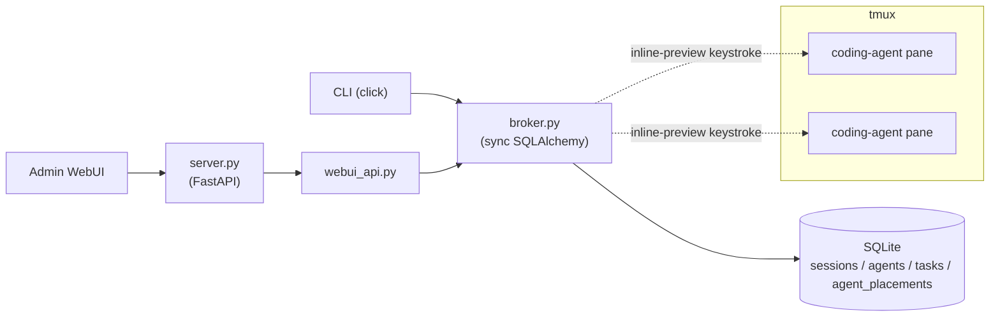

# Overview

CAFleet is a message broker and agent registry for coding agents. All CLI
commands and the admin WebUI access SQLite directly through a shared `broker`
module (`cafleet/broker.py`) — no HTTP server is needed for agent operations.
Agents are organized into **sessions** identified by a non-secret `session_id`
created via `cafleet session create`. Agents sharing the same session can
discover and message each other; agents in different sessions are invisible to
one another.

## Architecture diagram

`broker.py` is the single data access layer. Both the CLI and the Admin WebUI
call it. No async stores, no HTTP client, no protocol layer.

## Component layout

| Component | Location | Description |
|---|---|---|
| `broker.py` | `cafleet/src/cafleet/` | Single data access layer — sync SQLAlchemy operations for CLI + WebUI |
| `server.py` | `cafleet/src/cafleet/` | Minimal FastAPI app: `webui_router` + static file serving |
| `config.py` | `cafleet/src/cafleet/` | Settings via pydantic-settings; owns `~` expansion of `database_url` |
| `cli.py` | `cafleet/src/cafleet/` | Unified `cafleet` console script: click group with `db` (Alembic schema management), `session` (session CRUD), `agent` (registry: `register` / `deregister` / `list` / `show`), `message` (broker: `send` / `broadcast` / `poll` / `ack` / `cancel` / `show`), `member` (lifecycle: `create` / `delete` / `list` / `capture` / `send-input` / `exec`), and `base-dir` (filesystem-only: `resolve [TASK_NAME]` / `record`) subgroups. Also exposes `cafleet server [--host <addr>] [--port <int>]` and `cafleet doctor` as top-level meta-command exceptions. Calls `broker` directly. |
| `base_dir.py` | `cafleet/src/cafleet/` | Authoritative resolver for the `${BASE}` output-root used by every CAFleet scratch / audit / figure write. Owns the resolution state machine (CWD inference, anchor, `$HOME`-needs-user-input, task-scope), auto-mkdir of the task folder, and inline anchor writes at `<task-folder>/.cafleet-base-dir.json`. |
| `db/models.py` | `cafleet/src/cafleet/db/` | SQLAlchemy declarative models: `Base`, `Session`, `Agent`, `Task`; column indexes |
| `db/engine.py` | `cafleet/src/cafleet/db/` | `get_sync_engine()`, `get_sync_sessionmaker()`, SQLite PRAGMA listener |
| `alembic/` | `cafleet/src/cafleet/alembic/` | Alembic environment and migration scripts bundled into the wheel |
| `webui_api.py` | `cafleet/src/cafleet/` | WebUI API router (`/api/*`) — calls `broker` for all data access |
| `output.py` | `cafleet/src/cafleet/` | CLI output formatting (tables + JSON) |
| `coding_agent/` | `cafleet/src/cafleet/coding_agent/` | Coding-agent backend subpackage: `CodingAgent` Protocol (`base.py`), `ClaudeCodeAgent`, `CodexAgent`, `OpencodeAgent`, and the `CODING_AGENTS` registry. |
| `multiplexer/` | `cafleet/src/cafleet/multiplexer/` | Terminal multiplexer subpackage: `Multiplexer` Protocol + `MultiplexerContext` + `poll_until_pane_gone` (`base.py`), `TmuxMultiplexer` (`tmux.py`), and the `MULTIPLEXERS` registry. |
| `admin/` | Project root | WebUI SPA (Vite + React + TypeScript + Tailwind CSS) |

## Operation mapping

Every CLI command goes through `broker.py` (sync SQLAlchemy). No HTTP server
is involved for CLI commands.

| CLI command | `broker` function |
|---|---|
| `agent register` | `broker.register_agent()` → INSERT agents (+ agent_placements) |
| `message send` | `broker.send_message()` → validate dest + INSERT tasks |
| `message broadcast` | `broker.broadcast_message()` → list agents + INSERT tasks per recipient + summary |
| `message poll` | `broker.poll_tasks()` → SELECT tasks WHERE context_id |
| `message ack` | `broker.ack_task()` → verify recipient + UPDATE status → completed |
| `message cancel` | `broker.cancel_task()` → verify sender + UPDATE status → canceled |
| `message show --task-id <x>` | `broker.get_task()` → SELECT task + verify session |
| `agent list` | `broker.list_agents()` → SELECT agents WHERE active |
| `agent show --id <x>` | `broker.get_agent()` → SELECT agent + placement |
| `agent deregister` | `broker.deregister_agent()` → UPDATE status + DELETE placement |
| `member send-input` | `broker.get_agent()` → authorization check + `MULTIPLEXERS["tmux"].send_choice_key` / `send_freetext_and_submit`. |
| `member exec` | `broker.get_agent()` → authorization check + `MULTIPLEXERS["tmux"].send_bash_command`. Director-only shell-dispatch primitive. See [Bash routing](bash-routing.md). |
| `member ping` | `broker.get_agent()` → authorization check + `MULTIPLEXERS["tmux"].send_poll_trigger`. Director-only manual inbox-poll nudge. |
| `db init` | Alembic `upgrade head` |

## CLI option sources

Each CLI parameter has exactly one input source:

| Parameter | Source |
|---|---|
| Session ID | `--session-id` global flag (UUID; required for client + member subcommands) |
| Database URL | `CAFLEET_DATABASE_URL` env var (optional; default builds `sqlite:///<path>` from `~/.local/share/cafleet/registry.db` with `~` expanded at load time) |
| Agent ID | `--agent-id` subcommand option |
| JSON output | `--json` global flag |

Session ID and Agent ID are passed as literal CLI flags (not environment
variables) so a single Claude Code `permissions.allow` pattern of the form
`cafleet --session-id <literal-uuid> *` matches every subcommand for that
session, eliminating per-invocation permission prompts. `--session-id` is
global (placed before the subcommand) and required for every client + member
subcommand; it is silently accepted (and ignored) on `db init` / `session *`
/ `server` so one allow pattern stays usable everywhere. No broker URL is
needed — CLI commands access SQLite directly.

The `cafleet server` bind address and port are configured via `--host` /
`--port` flags (defaults sourced from `settings.broker_host` = `127.0.0.1`
and `settings.broker_port` = `8000`) or via the `CAFLEET_BROKER_HOST` /
`CAFLEET_BROKER_PORT` environment variables. Pydantic-settings wires these
env vars through explicit `validation_alias` on `Settings.broker_host` and
`Settings.broker_port`, matching the `CAFLEET_`-prefixed convention. CLI
flags win over env vars when both are supplied.

The canonical CLI surface — every subcommand and option — lives at
[CLI options](../spec/cli-options.md).

## WebUI

A browser-based dashboard served as a SPA at `/`. No login is required. The
first-load lands on a session picker at `/#/sessions`; selecting a session
navigates to a Discord-style unified timeline for that session — a sidebar
listing every active (top) and deregistered (muted) agent in the session, a
center timeline rendering unicast and broadcast messages ordered
newest-at-bottom with auto-scroll, reactions-as-ACKs chips that reveal
per-recipient ACK time on CSS hover, and a bottom input that parses
`@<agent> text` for unicast and `@all text` for broadcast.

The admin is NOT a CAFleet agent; the built-in `Administrator` agent
auto-seeded at `session create` time is used as `from_agent_id` on every
send. The dashboard renders a read-only "Sending as Administrator" label
(see `admin/src/components/Dashboard.tsx`). When the Administrator row is
missing or deregistered, send is disabled and the header surfaces a
diagnostic message pointing at `cafleet db init`.

The three primary views (SessionPicker, Dashboard, Timeline) auto-refresh
every 5 s with a subtle "Updating…" in-flight indicator; polling continues
regardless of tab visibility and overlapping ticks are dropped. The session
picker renders sessions newest-first by `created_at DESC, session_id ASC` as
returned by `broker.list_sessions()` — no client-side re-sort.

- **Frontend**: `admin/` — Vite + React 19 + TypeScript + Tailwind CSS 4
- **Backend API**: `/api/*` endpoints in `webui_api.py` — all endpoints call
  `broker` for data access (sync `def` handlers, FastAPI runs them in a
  thread pool).
- **Server**: `server.py` is a minimal FastAPI app — just `webui_router` +
  static files. No protocol handler, no JSON-RPC, no executor. Only needed
  for the WebUI; CLI commands work without it.
- **Session scoping**: Session-scoped endpoints require the `X-Session-Id`
  header. No authentication.
- **Static serving**: `StaticFiles` mount at `/` serves the SPA bundled
  inside the package at `cafleet/src/cafleet/webui/`. `mise //admin:build`
  must be run before `cafleet server` / `mise //cafleet:dev` for `/` to be
  populated; without it, `create_app()` emits a one-line warning and the
  server starts cleanly with `/` returning 404 until the SPA is built.

The WebUI API surface — request / response shape, session header convention,
and ACK chip metadata — lives at [WebUI API](../spec/webui-api.md).

## Package structure

A single Python package and a frontend app:

- **`cafleet/`** — `cafleet`: FastAPI + SQLAlchemy + Alembic + click (server +
  CLI). Ships the unified `cafleet` console script for all operations:
  `db init`, `session` management, agent registration, messaging, and member
  lifecycle. CLI commands access SQLite directly via `broker.py`; the FastAPI
  server is only needed for the admin WebUI.
- **`admin/`** — WebUI SPA: Vite + React + TypeScript + Tailwind CSS

A single `pip install cafleet` gives users both the broker server and the
agent CLI.

## Plugin packaging

CAFleet ships dual plugin manifests (Claude Code at `.claude-plugin/`, Codex
at `.codex-plugin/` + `.agents/plugins/marketplace.json`) over a shared
`skills/` tree. Both manifests anchor at the same `skills/` directory —
Claude's `.claude-plugin/plugin.json` enumerates each skill explicitly, while
Codex's `.codex-plugin/plugin.json` declares `"skills": "./skills/"` and
auto-bundles every `SKILL.md` under it. The two manifests' `name`, `version`,
and `description` fields are kept byte-identical so a single edit on a
release cuts both plugins simultaneously.

## Design document orchestration skills

CAFleet ships CAFleet-native replicas of the global Agent Teams design
document workflows. They replace Claude Code's `TeamCreate` /
`Agent(team_name=...)` / `SendMessage` primitives with `cafleet agent
register`, `cafleet member create`, and `cafleet message send`, so every
inter-agent message is persisted in SQLite and visible in the admin WebUI
timeline.

| Skill | Location | Purpose |
|---|---|---|
| `cafleet-design-doc` | `skills/cafleet-design-doc/` | Plugin-local copy of the global design-doc skill (template + guidelines). Spawned members load this instead of the global skill so the plugin is self-contained. |
| `cafleet-design-doc-create` | `skills/cafleet-design-doc-create/` | Create a design document through CAFleet-orchestrated Director / Drafter / Reviewer roles. Mirrors the process of the global design-doc-create skill. |
| `cafleet-design-doc-execute` | `skills/cafleet-design-doc-execute/` | Execute a design document through CAFleet-orchestrated Director / Programmer / Tester / (optional) Verifier roles with per-step TDD cycle. Mirrors the process of the global design-doc-execute skill. |

**Role files**: Each `*-create` and `*-execute` skill ships a `roles/`
directory with one Markdown file per role. The Director reads the relevant
role file and embeds its content verbatim in the `cafleet member create`
spawn prompt.

**Communication pattern**: Director → member messages are delivered via
`cafleet message send`, which triggers a tmux push notification that injects
an inline preview into the member's pane. Member → Director replies use the
same `cafleet message send` path. The Director runs the
`cafleet-agent-team-monitoring` skill's `/loop` to watch for incoming
messages and stalled panes; supervision obligations come from the paired
`cafleet-agent-team-supervision` skill.

**Coexistence**: The global design-doc-create and design-doc-execute Agent
Teams skills remain functional. A user picks between them based on whether
they want ephemeral in-memory coordination (Agent Teams) or a persistent,
auditable message trail in SQLite + WebUI (CAFleet).
