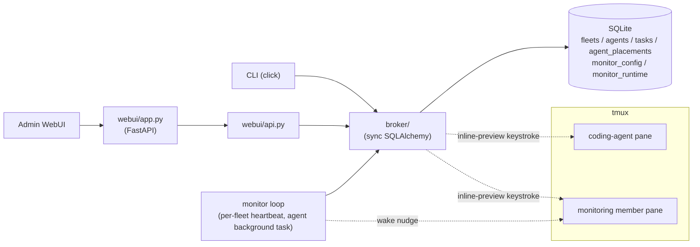

# Overview

CAFleet is a message broker and agent registry for coding agents. All CLI
commands and the admin WebUI access SQLite directly through a shared broker
package — no HTTP server is needed for agent operations. Agents are organized
into **fleets** identified by a non-secret `fleet_id` created via
`cafleet fleet create`. Agents sharing the same fleet can discover and message
each other; agents in different fleets are invisible to one another.

## Core terms

| Term | Definition | Links to |
|---|---|---|
| fleet | isolated namespace partitioning agents; identified by a non-secret integer `fleet_id` | [Fleet isolation](fleet-isolation.md) |
| root Director | the agent created by `fleet create`; the only agent that may own members | [Member lifecycle](member-lifecycle.md) |
| member | an agent spawned by the Director via `cafleet agent spawn`, bound to a tmux pane | [Member lifecycle](member-lifecycle.md) |
| placement | the row linking an agent to its tmux session/window/pane and backend | [Data model](../spec/data-model.md) |
| Administrator | the built-in write-only agent that the WebUI sends as | [Data model](../spec/data-model.md) |
| broker | the data-access layer all CLI commands and the WebUI share; writes SQLite directly | Overview (this page) |
| task / message | one delivered message; lifecycle `input_required → completed/canceled` | [Message envelope](../spec/message-envelope.md) |
| inline preview | the 2-line message preview the broker keystrokes into the recipient's pane | [tmux push](tmux-push.md) |
| poll / ack | how a recipient fetches and then confirms consumption of a message | [CLI options](../spec/cli-options.md) |
| coding-agent backend | the binary in a member pane: `claude`, `codex`, or `opencode` | [Coding agents](coding-agents.md) |
| monitor | a fleet-scoped loop the monitoring member runs as a background task, waking the monitoring member by keystroke whenever a watched agent (Director or member) is due on its own interval | [Monitoring](monitoring.md) |

## Architecture diagram

## CLI

The `cafleet` CLI is organized as three top-level commands (`setup`, `doctor`,
`server`) plus five command groups:

| Group | Scope | Subcommands |
|---|---|---|
| `fleet` | fleet lifecycle | `create`, `list`, `show`, `delete` |
| `agent` | registry + pane-bound lifecycle | `register`, `list`, `show`, `deregister`, `spawn` |
| `pane` | keystroke interaction with a pane-bound agent | `capture`, `input`, `exec`, `wake` |
| `message` | the message broker | `send`, `broadcast`, `poll`, `ack`, `cancel`, `show` |
| `monitor` | the supervision scheduler | `start`, `status`, `config` |

`agent` is the single mental model for the registry and lifecycle (a "member" is
just an agent with a placement); `pane` is the single home for keystroke
interaction with a pane-bound agent. The canonical CLI surface — every
subcommand, option, and option source — lives at
[CLI options](../spec/cli-options.md).

## WebUI

A browser-based dashboard served as a SPA at `/`, with no login: a fleet
picker, then a Discord-style unified timeline per fleet — an agent sidebar,
unicast and broadcast messages, and a bottom input parsing `@<agent> text` and
`@all text`. The admin is not itself a CAFleet agent; the built-in
`Administrator` is the implicit sender. The full API surface and per-agent
routes live at [WebUI API](../spec/webui-api.md).

## Monitoring

A Director supervises its team on a periodic tick supplied by `cafleet monitor`
— a per-fleet loop the fleet's dedicated monitoring member runs as a background
task. It spends no model tokens and, being a plain loop rather than agent
reasoning, works the same on any backend. The monitor owns only the scheduling;
the monitoring member inspects each due agent and re-engages an idle Director,
who owns the supervision actions. See [Monitoring](monitoring.md).

## Design-document orchestration

CAFleet ships design-document skills that coordinate a Director and members
entirely through `cafleet message send`, so every inter-agent message is
persisted and auditable. See [Quickstart](../get-started/quickstart.md).
