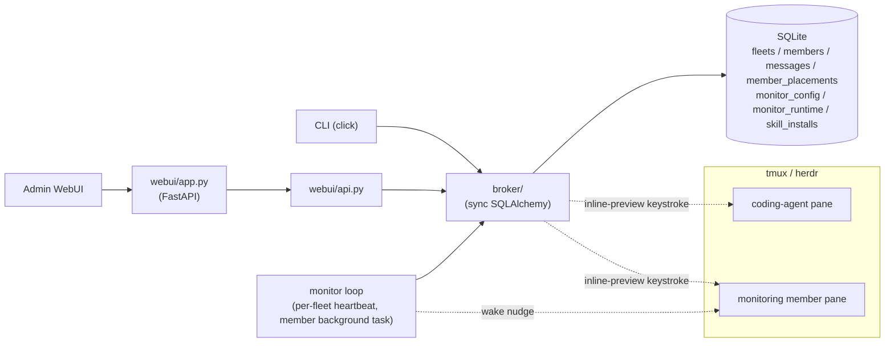

# Overview

CAFleet is a message broker and member registry for coding agents. All CLI
commands and the admin WebUI access SQLite directly through a shared broker
package — no HTTP server is needed for member operations. Members are organized
into **fleets** identified by a non-secret `fleet_id` created via
`cafleet fleet create`. Members sharing the same fleet can discover and message
each other; members in different fleets are invisible to one another.

## Core terms

| Term | Definition | Links to |
|---|---|---|
| fleet | isolated namespace partitioning members; identified by a non-secret integer `fleet_id` | [Fleet isolation](fleet-isolation.md) |
| root Director | the member created by `fleet create`; the only member that may own other members | [Member lifecycle](member-lifecycle.md) |
| member | a registry entry spawned by the Director via `cafleet member create`, bound to a multiplexer pane (tmux or herdr) | [Member lifecycle](member-lifecycle.md) |
| placement | the row linking a member to its multiplexer session/window/pane and backend | [Data model](../spec/data-model.md) |
| broker | the data-access layer all CLI commands and the WebUI share; writes SQLite directly | Overview (this page) |
| task / message | one delivered message; lifecycle `input_required → completed/canceled` | [Message envelope](../spec/message-envelope.md) |
| inline preview | the 2-line message preview the broker keystrokes into the recipient's pane | [Multiplexer backends](../spec/multiplexer-backends.md#push-notifications) |
| poll / ack | how a recipient fetches and then confirms consumption of a message | [CLI options](../spec/cli-options.md) |
| coding-agent backend | the binary in a member pane: `claude`, `codex`, or `opencode` | [Coding agents](coding-agents.md) |
| monitor | a fleet-scoped loop the monitoring member runs as a background task, waking the monitoring member by keystroke whenever a watched member (Director or ordinary member) is due on its own interval | [Monitoring](monitoring.md) |

## Architecture diagram

## CLI

The `cafleet` CLI is organized as three top-level commands (`setup`, `doctor`,
`server`) plus four command groups:

| Group | Scope | Subcommands |
|---|---|---|
| `fleet` | fleet lifecycle | `create`, `list`, `show`, `delete` |
| `member` | member lifecycle + keystroke interaction | `create`, `delete`, `show`, `list`, `capture`, `exec`, `ping` |
| `message` | the message broker | `send`, `broadcast`, `poll`, `ack`, `cancel`, `show` |
| `monitor` | the supervision scheduler | `start`, `status`, `config` |

`member` is the single home for the member lifecycle — spawn, teardown,
introspection (`show`, `list`), and keystroke interaction (the `kind` column in
list output distinguishes the root `director`, the `monitor`, and ordinary
`member` rows). The canonical CLI surface — every
subcommand, option, and option source — lives at
[CLI options](../spec/cli-options.md).

## WebUI

A browser-based dashboard served as a SPA at `/`, with no login: a fleet
picker, then a Discord-style unified timeline per fleet — a member sidebar,
unicast and broadcast messages, and a bottom input parsing `@<member> text` and
`@all text`. Every send goes out as the fleet's root Director — the operator
never registers as a member to use the dashboard. The full API surface and
per-member routes live at [WebUI API](../spec/webui-api.md).

## Monitoring

A Director supervises its team on a periodic tick supplied by `cafleet monitor`
— a per-fleet loop the fleet's dedicated monitoring member runs as a background
task. It spends no model tokens and, being a plain loop rather than agent
reasoning, works the same on any backend. The monitor owns only the scheduling;
the monitoring member classifies each due member and re-engages the Director when it
finds a `stalled`/`finished` pane, and the Director owns the supervision actions.
See [Monitoring](monitoring.md).

## Design-document orchestration

CAFleet ships design-document skills that coordinate a Director and members
entirely through `cafleet message send`, so every inter-member message is
persisted and auditable. See [Quickstart](../get-started/quickstart.md).
