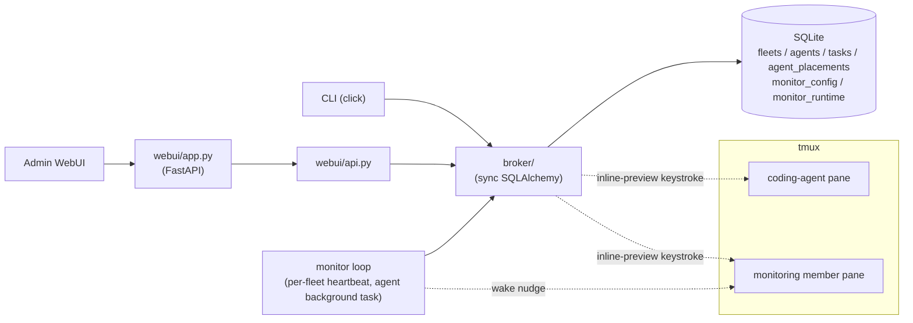

# Overview

CAFleet is a message broker and agent registry for coding agents. All CLI
commands and the admin WebUI access SQLite directly through a shared broker
package — no HTTP server is needed for agent operations. Agents are organized
into **fleets** identified by a non-secret `fleet_id` created via
`cafleet fleet create`. Agents sharing the same fleet can discover and message
each other; agents in different fleets are invisible to one another.

## Core terms

| Term | Definition | Links to |
|---|---|---|
| fleet | isolated namespace partitioning agents; identified by a non-secret integer `fleet_id` | [Fleet isolation](fleet-isolation.md) |
| root Director | the agent created by `fleet create`; the only agent that may own members | [Member lifecycle](member-lifecycle.md) |
| member | an agent spawned by the Director via `member create`, bound to a tmux pane | [Member lifecycle](member-lifecycle.md) |
| placement | the row linking an agent to its tmux session/window/pane and backend | [Data model](../spec/data-model.md) |
| Administrator | the built-in write-only agent that the WebUI sends as | [Data model](../spec/data-model.md) |
| broker | the data-access layer all CLI commands and the WebUI share; writes SQLite directly | Overview (this page) |
| task / message | one delivered message; lifecycle `input_required → completed/canceled` | [Message envelope](../spec/message-envelope.md) |
| inline preview | the 2-line message preview the broker keystrokes into the recipient's pane | [tmux push](tmux-push.md) |
| poll / ack | how a recipient fetches and then confirms consumption of a message | [CLI options](../spec/cli-options.md) |
| coding-agent backend | the binary in a member pane: `claude`, `codex`, or `opencode` | [Coding agents](coding-agents.md) |
| monitor | a fleet-scoped loop a coding agent runs as a background task, waking due agents on a fixed cadence by keystroking `message poll` into their panes | [Monitoring](monitoring.md) |

## Architecture diagram

The broker package is the single data access layer. Both the CLI and the Admin
WebUI call it. No async stores, no HTTP client, no protocol layer.

## CLI

The canonical CLI surface — every subcommand, option, and option source —
lives at [CLI options](../spec/cli-options.md).

## WebUI

A browser-based dashboard served as a SPA at `/`, with no login. The first
load lands on a fleet picker; selecting a fleet opens a Discord-style unified
timeline for that fleet — a sidebar of the fleet's agents, a center timeline
of unicast and broadcast messages, and a bottom input that parses
`@<agent> text` for unicast and `@all text` for broadcast. Clicking an agent
in the sidebar opens a per-agent detail panel
(`#/fleets/<fleetId>/agents/<agentId>`) showing the agent's profile plus
Inbox / Sent tabs fed by the per-agent message endpoints. The admin is not
itself a CAFleet agent; the built-in `Administrator` agent is the implicit
sender on every send.

The WebUI API surface — request / response shape, fleet header convention,
and ACK chip metadata — lives at [WebUI API](../spec/webui-api.md).

## Monitoring

A Director supervises its team on a periodic tick. That tick is supplied by
`cafleet monitor` — a per-fleet loop the fleet's dedicated monitoring member runs
as a background task, waking **only** the monitoring member by keystroking a wake
nudge into its pane. It is a plain loop, not agent reasoning, so the heartbeat
works the same on any backend. The monitor owns only the *when* (the monitoring
member is due); the monitoring member re-engages the idle Director on demand, and
the Director owns the *what* (poll, ACK, dispatch, health-check, escalate). See
[Monitoring](monitoring.md).

## Design document orchestration skills

CAFleet ships CAFleet-native design-document skills
(`cafleet-design-doc-create`, `cafleet-design-doc-execute`) that coordinate a
Director and spawned members entirely through `cafleet message send`, so every
inter-agent message is persisted in SQLite and visible in the admin WebUI
timeline — an auditable trail, in contrast to the ephemeral in-memory
coordination of Agent Teams. See [Quickstart](../get-started/quickstart.md)
and [Contributing](../get-started/contributing.md).
