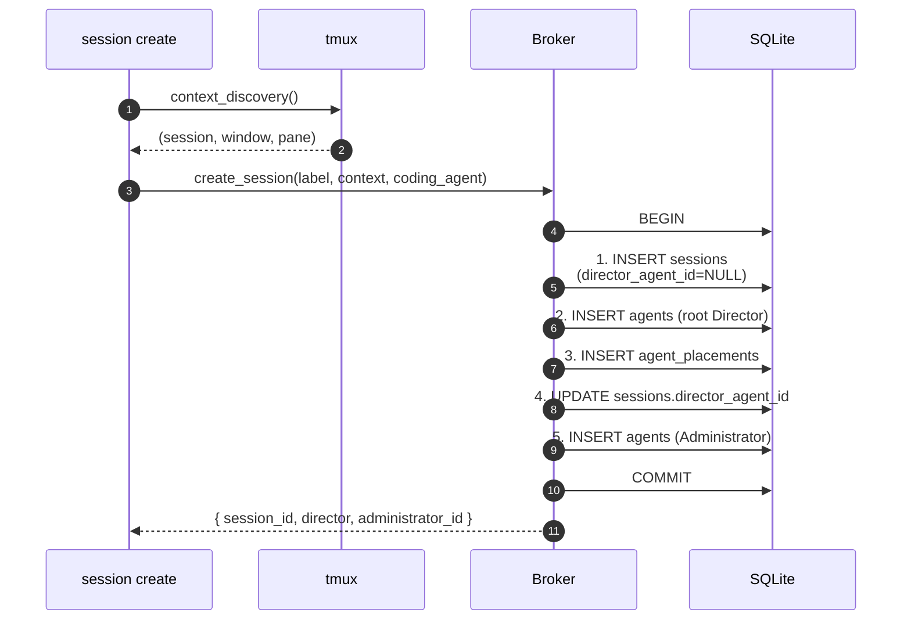

# Session isolation

The `session_id` serves as the session boundary. Sessions are created via
`cafleet session create`. All agents registered with the same `session_id`
form one session. The broker does not perform authentication — it performs
session routing only.

The `session_id` is a non-secret session identifier. Sessions are partitions
for tidiness, not security boundaries.

## Registration

Registration requires a valid, non-soft-deleted `session_id`. Sessions are
created via `cafleet session create` before any members can be spawned.

## Isolation rules

Every operation that reads or writes agent / task data enforces session
boundaries. Cross-session requests always produce "not found" errors
indistinguishable from the resource not existing.

## Session bootstrap (transactional)

`cafleet session create` must be run inside a tmux session. It reads the
caller's tmux context (`session`, `window_id`, `pane_id`) via
`MULTIPLEXERS["tmux"].context_discovery()` **before** opening any DB work,
then executes a single transaction with five ordered operations:

Any failure in the transaction rolls the whole thing back — no partial
session / agent / placement rows can persist. Outside tmux the CLI fails with
`Error: cafleet session create must be run inside a tmux session` and exit
code 1 before touching the DB.

The post-bootstrap invariant is that every non-deleted `sessions` row has a
non-NULL `director_agent_id`. The column itself is DB-nullable because the
5-step insert order requires `sessions` to exist before the agent row it will
eventually reference, so the NOT NULL constraint is enforced by the broker
code path — not by the schema.

## Session soft-delete

`cafleet session delete <id>` runs a single transaction:

1. `UPDATE sessions SET deleted_at=now WHERE session_id=X AND deleted_at IS NULL`
2. `UPDATE agents SET status='deregistered', deregistered_at=now WHERE session_id=X AND status='active'` (this sweeps the root Director and every member in one statement)
3. `DELETE FROM agent_placements WHERE agent_id IN (SELECT agent_id FROM agents WHERE session_id=X)`

Tasks are never touched — the message history remains queryable. The command
is idempotent: re-running against an already-deleted session prints `Deleted
session X. Deregistered 0 agents.` and exits 0 because step 1's `WHERE
deleted_at IS NULL` clause short-circuits the cascade. It is **not**
transactional with tmux: surviving member panes are orphaned intentionally.
Directors that want a clean shutdown run `cafleet member delete` per member
first (which does send `/exit`), then `session delete`.

## Soft-delete visibility

`broker.get_session` exposes the `deleted_at` field but otherwise returns the
row regardless of its value; `broker.list_sessions` filters
`WHERE deleted_at IS NULL` so the CLI's `session list` hides deleted rows.
`broker.register_agent` inspects `get_session(...)["deleted_at"]` and rejects
a soft-deleted session with `Error: session X is deleted` (distinct from the
`Session 'X' not found.` path for an unknown ID).

## Root Director protection

`broker.deregister_agent` refuses to deregister the root Director (detected
by `sessions.director_agent_id == agent_id`) and exits 1 with `Error: cannot
deregister the root Director; use 'cafleet session delete' instead.`. This
keeps `sessions.director_agent_id` from pointing at a deregistered,
placement-less agent, which would otherwise silently break Member → Director
tmux push notifications.

## Built-in Administrator agent

`cafleet session create` inserts a single `Administrator` agent into the new
session in the same transaction as the session row. The Administrator is an
ordinary `agents` row distinguished only by `agent_card_json.cafleet.kind ==
"builtin-administrator"` — no schema change, no separate table. Every session
has exactly one Administrator, and Alembic revision
`0006_seed_administrator_agent.py` seeds it (idempotent via a `json_extract`
probe).

The Admin WebUI Send control always submits messages with
`from_agent_id = administrator.agent_id`, so there is no sender dropdown.
Protection lives entirely in `broker.py`: `broker.deregister_agent` and
`broker.register_agent` both raise `click.ClickException` (preventing
deregister and preventing `placement.director_agent_id` from pointing at an
Administrator — the Administrator never receives a tmux pane).
`broker.broadcast_message` filters Administrators out of the recipient set,
so they are write-only identities. The CLI surfaces the guard as a
single-line `Error: Administrator cannot be deregistered` on stderr with exit
code 1 and no `Usage:` banner.
