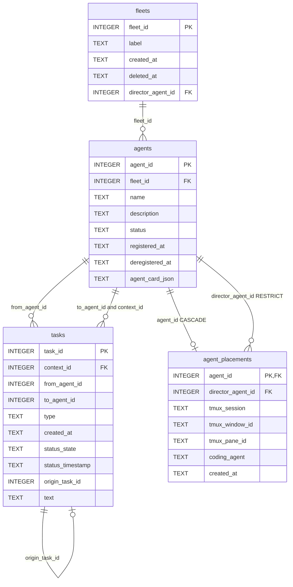

# Storage

## Backend

Everything is persisted in a single SQLite database accessed through
SQLAlchemy 2.x with the sync `pysqlite` driver. Schema changes are managed
by Alembic, bundled inside the `cafleet` wheel and applied via
`cafleet db init`. There is no separate database daemon to operate, monitor,
or back up — the database is a single file.

The default database path is `~/.local/share/cafleet/cafleet.db` (XDG state
directory), expanded once at config load time. Override with the
`CAFLEET_DATABASE_URL` environment variable, e.g.
`sqlite:////var/lib/cafleet/cafleet.db`.

**Concurrency**: `PRAGMA busy_timeout=5000` is set on every connection.
SQLite retries internally for up to 5 seconds before returning `SQLITE_BUSY`.
Expected contention is low — CLI operations are short transactions (single
INSERT or UPDATE), and multiple agents polling concurrently is read-only.

## Predominantly relational model

Indexed and routing fields are typed columns. The only JSON `TEXT` blob is
`agents.agent_card_json` (an `AgentCard`-shaped document, not queried by
content). Every Task field lives in its own typed column.

| Table | Indexed columns | JSON blob |
|---|---|---|
| `fleets` | `fleet_id` (PK) | — |
| `agents` | `agent_id` (PK), `fleet_id` (FK → `fleets`), `status` | `agent_card_json` |
| `tasks` | `task_id` (PK), `context_id` (FK → `agents`), `from_agent_id`, `to_agent_id`, `type`, `status_state`, `status_timestamp`, `origin_task_id`, `text` | — |
| `agent_placements` | `agent_id` (PK, FK → `agents` CASCADE), `director_agent_id` (nullable, FK → `agents` RESTRICT), `tmux_session`, `tmux_window_id`, `tmux_pane_id` (nullable) | — |

`tasks.text` is the message body as a typed column. The typed columns (plus
`text`) reconstruct every shape the broker, CLI, and WebUI need; no opaque
per-task blob is stored.

The `agent_placements.director_agent_id` parent-child edge (nullable FK →
`agents` RESTRICT) is used by `broker._try_notify_recipient` to resolve the
recipient pane and by `cafleet member list` to enumerate Director-owned
members. The `tasks.origin_task_id` self-reference threads broadcast
deliveries back to the broadcaster's summary row — see
[message envelope](../spec/message-envelope.md) for the broadcast threading
shape.

Four indexes serve the hot read paths:

- `idx_agents_fleet_status (fleet_id, status)` — list active agents in a fleet.
- `idx_tasks_context_status_ts (context_id, status_timestamp DESC)` — inbox listing.
- `idx_tasks_from_agent_status_ts (from_agent_id, status_timestamp DESC)` — sender outbox in the WebUI.
- `idx_placements_director (director_agent_id)` — list members spawned by a Director.

`PRAGMA foreign_keys=ON` and `PRAGMA busy_timeout=5000` are issued on every
new connection via a SQLAlchemy engine `connect` event listener so the FK
declarations in `models.py` are enforced and concurrent access is handled
gracefully. A regression test verifies the PRAGMAs are active on a fresh
connection.

## Session ownership

`broker.py` uses module-level `get_sync_sessionmaker()` from `db/engine.py`.
Each function opens a fresh session, executes within a transaction, and
returns dicts. No async, no store classes, no dependency injection — just
plain function calls.

## Schema management

A single Alembic revision is committed to the repository:
`0001_initial_schema.py` (`down_revision=None`). It is schema-only — it
creates all four tables (with `INTEGER PRIMARY KEY AUTOINCREMENT` on the three
minted-id tables) and the four indexes, and carries no seed INSERTs (the
Administrator and Director are created at runtime by `broker.create_fleet`).
Operators run `cafleet db init` once before starting the server. The command
is idempotent across six DB states:

| State | Action |
|---|---|
| File missing | Create parent directory; `command.upgrade(cfg, "head")` |
| Empty schema | `command.upgrade(cfg, "head")` |
| At head | No-op; print "already at head" |
| Behind head | `command.upgrade(cfg, "head")`; print "upgraded from X to Y" |
| Ahead of head | Error; refuse to downgrade automatically |
| Unversioned (tables exist, no `alembic_version`) | Error; instruct operator to run `alembic stamp head` manually |

Without `db init`, the first request fails with `OperationalError: no such
table: agents`. The development workflow uses `alembic revision
--autogenerate` directly; the `revision` and `downgrade` commands are not
exposed via the CLI.

## Upgrading across the integer-PK rearchitecture

There is **no data migration and no backward compatibility** across the
integer-PK rearchitecture. Delete any pre-existing database. The default file
moved from `~/.local/share/cafleet/registry.db` to
`~/.local/share/cafleet/cafleet.db`, so the old file is left untouched and
ignored — remove it manually. If you set `CAFLEET_DATABASE_URL` to a custom
path holding an old (UUID-era) schema, `cafleet db init` refuses to run
against its unknown Alembic revision; delete that file and re-run
`cafleet db init`.

## No physical cleanup

Deregistered agents and their tasks remain in the database forever. There is
no background cleanup loop. Active query paths filter `status='active'` so
dead rows are invisible to normal traffic; the WebUI is the only consumer
that surfaces deregistered agents (so their inbox history can be inspected).
If physical cleanup becomes necessary later, it can be added as an opt-in
admin command without disturbing the runtime.

## contextId convention

The Broker sets `contextId = recipient_agent_id` on every delivery Task.
This enables inbox discovery — recipients call `poll_tasks(context_id =
my_agent_id)` to find all messages addressed to them. This trades
per-conversation grouping (the typical contextId use case) for simple inbox
discovery, which suits the fire-and-forget messaging pattern of coding
agents. `contextId` is treated as an opaque routing key by both server and
clients.

## Task lifecycle mapping

Each message delivery is modeled as a Task:

| Task state | Message meaning |
|---|---|
| `TASK_STATE_INPUT_REQUIRED` | Message queued, awaiting recipient pickup (unread) |
| `TASK_STATE_COMPLETED` | Message acknowledged by recipient |
| `TASK_STATE_CANCELED` | Message retracted by sender before ACK |
| `TASK_STATE_FAILED` | Routing error (returned immediately to sender) |

See [message envelope](../spec/message-envelope.md) for the full envelope
specification.
