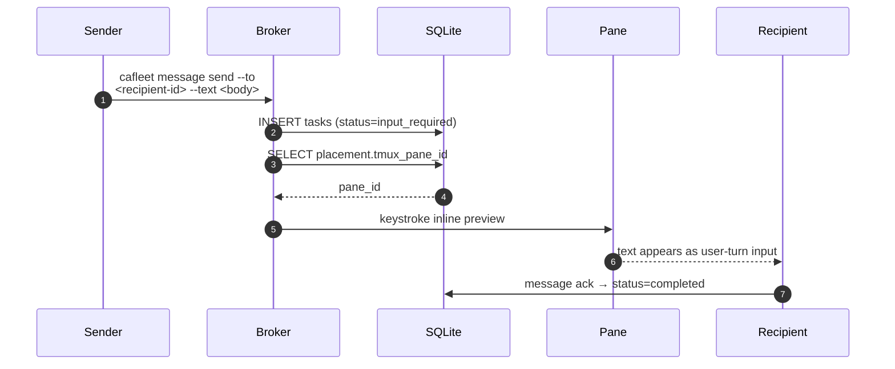

# tmux push notifications

CAFleet uses a pull-based delivery model by default: recipients discover
messages via `cafleet message poll`. To reduce latency, the broker keystrokes
a 2-line inline preview (`[cafleet msg …]` header + truncated body) into the
recipient's tmux pane immediately after persisting a message, so the
recipient's coding-agent process consumes the preview as a fresh user-turn
input without invoking `cafleet message poll`. The poll-trigger keystroke
(which DOES inject a literal `cafleet message poll` command) is reserved for
the Director-issued `cafleet member ping` manual nudge — not the broker's
auto-fire path.

## Send + push notification



After saving a delivery task, the broker looks up the recipient's
`agent_placements` row (the root Director's placement carries
`director_agent_id=NULL` for "no parent"). The recipient pane is resolved by
`agent_id` alone, so Member → Director notifications work automatically. If the
recipient has a non-null `tmux_pane_id` and is not the sender, the broker
keystrokes an inline preview into the recipient's pane via the
`tmux.send_inline_preview` helper:

```text
[cafleet msg <task_id> from <sender_id> <ts>]
<text-truncated-to-CAFLEET_MAX_TEXT_LEN>
```

The recipient's coding agent processes the keystroked text as a fresh
user-turn input — no `cafleet message poll` invocation is in the auto-fire
path. The recipient acks via `cafleet message ack --task-id <task_id>` once
it has consumed the message.

The keystroke **leads with `Esc`** (`tmux.send_inline_preview` is called with
`esc_first=True`): it presses `Escape`, lets the pane settle ~0.1 s, then types
the payload and `Enter`, so a recipient parked on a pending permission-approval
prompt has that prompt dismissed before the trailing `Enter` lands. The same
`Esc`-safeguarded path serves `message send`, `message broadcast`, and
`member nudge`; the monitor loop's wake nudge is the lone exception — see
[Monitoring](monitoring.md).

If the recipient's TUI is in a non-input state, the keystroked preview lands
wherever the cursor is (the same failure mode any pane keystroke has). The
fallback is `cafleet member list --activity` (the Director sees the recipient's
`last_recv` go stale), then `cafleet member ping --member-id <recipient-id>` —
the manual poll-nudge path: via the `send_poll_trigger` helper (also
`esc_first=True`) it injects `Esc` → the `cafleet message poll` command →
`Enter` into the pane and converts a failure to exit 1, so the recipient drains
whatever accumulated after a missed inline preview.

## Design principles

- **Best-effort**: The message queue remains the sole source of truth. Push
  notification is an optimization — if it fails, the message is still
  available for normal polling.
- **Self-send skip**: When sender == recipient, the notification is
  suppressed.
- **Silent failure**: Missing placements, null `tmux_pane_id`, dead panes,
  and absent `tmux` binary all result in no notification — no exceptions
  propagate to the caller.
- **No `TMUX` env var required**: `tmux send-keys -t <pane>` works from any
  process on the same host as long as the tmux server socket is accessible.

**Response annotations**: Unicast responses include a top-level
`notification_sent` boolean. Broadcast responses expose
`notifications_sent_count` as a top-level wrapper field (returned alongside
the `broadcast_summary` task), reflecting how many recipient panes were
successfully triggered. The count is NOT persisted — it lives only in the
broker return value.

Body truncation in the preview (the `…` suffix at `CAFLEET_MAX_TEXT_LEN`
codepoints) is documented in
[CLI options](../spec/cli-options.md#message-body-truncation).
