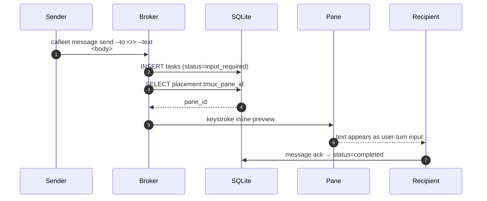

# tmux push notifications

CAFleet uses a pull-based delivery model by default: recipients discover
messages via `cafleet message poll`. To reduce latency, the broker keystrokes
a 2-line inline preview (`[cafleet msg …]` header + truncated body) into the
recipient's tmux pane via `send_inline_preview` immediately after persisting
a message, so the recipient's coding-agent process consumes the preview as a
fresh user-turn input without invoking `cafleet message poll`. The
`send_poll_trigger` keystroke (which DOES inject a literal `cafleet message
poll` command) is reserved for the Director-issued `cafleet member ping`
manual nudge — not the broker's auto-fire path.

## Send + push notification



After `broker` saves a delivery task, it looks up the recipient's
`agent_placements` row. Every agent spawned by `cafleet member create` has a
placement row, and every fleet's root Director also gets one at
`cafleet fleet create` time (its placement carries `director_agent_id=NULL`
to indicate "no parent"). Because `_try_notify_recipient` resolves a pane by
`agent_id` alone, Member → Director notifications work automatically once
the root Director has a placement row. If the recipient has a non-null
`tmux_pane_id` and is not the sender, the broker keystrokes an inline
preview of the message itself into the recipient's pane via
`TmuxMultiplexer.send_inline_preview` (imported and instantiated per-call so
per-test `monkeypatch.setattr` on the class method is honored):

```text
[cafleet msg <task_id> from <sender_id> <ts>]
<text-truncated-to-CAFLEET_MAX_TEXT_LEN>
```

The recipient's coding agent processes the keystroked text as a fresh
user-turn input — no `cafleet message poll` invocation is in the auto-fire
path. The recipient acks via `cafleet message ack --task-id <task_id>` once
it has consumed the message.

The `TmuxMultiplexer.send_inline_preview` method is **NOT** a reuse of
`send_freetext_and_submit` (which prepends a literal `4` for
AskUserQuestion option-4 freetext semantics; reusing it would type a stray
`4` into the recipient's input box). The helper combines the literal-text-
plus-Enter pattern from `send_poll_trigger` with the codex bracketed-paste
delay so all three backends (`claude`, `codex`, `opencode`) see the
preview as a single user-turn message.

If the recipient's TUI is in a non-input state, the keystroked preview
lands wherever the cursor is (the same failure mode any pane keystroke has). The fallback chain is `cafleet member list
--activity` (Director observes the recipient's `last_recv` column went
stale), then `cafleet member ping --member-id <r>` (manual
re-poke that injects the `cafleet message poll` command + Enter so the recipient
catches up via a normal `message poll` round-trip).

## Design principles

- **Best-effort**: The message queue remains the sole source of truth. Push
  notification is an optimization — if it fails, the message is still
  available for normal polling.
- **Self-send skip**: When sender == recipient, the notification is
  suppressed.
- **Silent failure**: Missing placements, null `tmux_pane_id`, dead panes,
  and absent `tmux` binary all result in `False` — no exceptions propagate
  to the caller.
- **No `TMUX` env var required**: `tmux send-keys -t <pane>` works from any
  process on the same host as long as the tmux server socket is accessible.

**Response annotations**: Unicast responses include a top-level
`notification_sent` boolean. Broadcast responses expose
`notifications_sent_count` as a top-level wrapper field (returned alongside
the `broadcast_summary` task), reflecting how many recipient panes were
successfully triggered. The `tasks` schema has no metadata blob — the count
is NOT persisted on the summary row; it lives only in the broker return value.

**Manual entry-point**: `TmuxMultiplexer.send_poll_trigger` survives as the
method for the **manual** poll-nudge path only — the sole caller is
`cafleet member ping` (the Director-only manual nudge subcommand, which
converts a `False` return to exit 1 so an operator or monitoring loop sees
the failure). Auto-fire on every `cafleet message send` uses
`TmuxMultiplexer.send_inline_preview`; the `member ping` path keeps the
"type the poll command + Enter" behavior because that primitive is exactly
what an operator wants when the recipient missed an inline preview and
needs to drain whatever has accumulated.

## CLI message body truncation

Every `cafleet message *` subcommand that emits a user-supplied delivery
body (`send`, `poll`, `ack`, `cancel`, `show`) truncates the `text` body to
the first `CAFLEET_MAX_TEXT_LEN` (default `200`) Unicode codepoints with a
literal `…` suffix in both text and `--json` output by default. Empty
bodies and bodies whose codepoint length is at most `CAFLEET_MAX_TEXT_LEN`
(default `200`) pass through unchanged with no marker. A per-subcommand
`--full` flag restores the un-truncated body. Truncation runs in
`cafleet/src/cafleet/output.py` via `truncate_text` and `truncate_task_text`
helpers and is wired into the message subcommands through the shared
`_client_command` decorator before either the text formatter or
`format_json` runs, so `--full` and `--json` compose orthogonally.

`cafleet message broadcast` is different —
`broker.broadcast_message` returns a single envelope list containing a
`broadcast_summary` task whose top-level `text` column is the broker-
generated summary string (e.g. `Broadcast sent to N recipients`), not the
original body. `message_broadcast` is wired with `truncates_task_text=True`: the summary
renders as a one-line `broadcast id=… recipients=…` by default and as the
full typed-column envelope under `--full`. The short summary string is
truncated only if `CAFLEET_MAX_TEXT_LEN` is set below its length, and
`--full` never adds per-recipient envelopes or a `recipient_ids` list.

The truncation applies to CLI emit sites only. FastAPI `/api/*` responses
are unchanged — the WebUI is human-facing and renders full bodies. `member
capture` content, `agent.description`, `skills[].description`, and
`agent_card_json` sub-fields are also untouched in this release.
