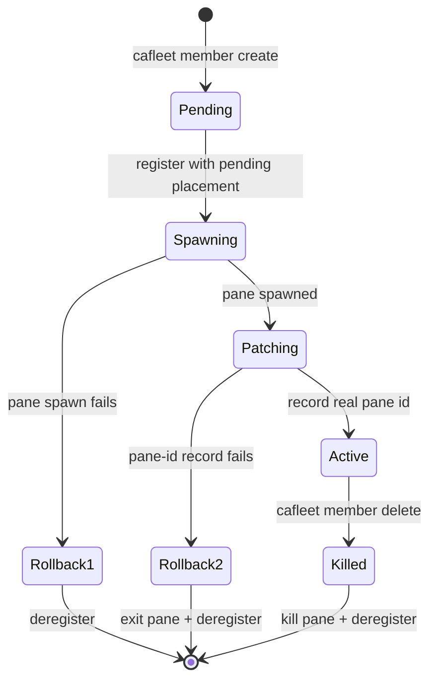

# Member lifecycle

The `cafleet member` CLI group wraps the two-step "register + spawn a
tmux pane" recipe behind `cafleet member create` and persists the member-to-pane
mapping in the `member_placements` table. An ordinary member is an active
registry row with a placement row other than the fleet's root Director,
spawned by a Director via `cafleet member create` and linked to a specific
tmux pane, window, and session. The root Director is instead bootstrapped
internally by `cafleet fleet create`, keeping its own placement row since it
is pane-bound.

**Single-Director invariant**: A fleet has exactly one Director — the root
Director recorded in `fleets.director_member_id` at `fleet create` time. Only
that root Director may own members: `cafleet member create` resolves the
Director from the fleet row itself, so a member can never be another member's
Director by construction. The team model is a single flat tier; there is no
team nesting.

## Lifecycle state diagram

## Atomic create flow

`cafleet member create` is atomic: it registers the member with a
pending placement (no pane id yet), spawns the member pane in the Director's
own tmux window, then patches the placement row with the real pane id. If the
spawn or the patch fails, the registration is rolled back. The pending window
is ping-tolerant: `cafleet member ping` against a member whose placement has
no pane yet skips the keystroke and succeeds — the member polls its inbox on
spawn, so there is nothing a ping would add. The new pane is
created without stealing focus, so the Director's active window is unchanged.
Identity reaches the spawned pane as literals rendered into the prompt:
`cafleet member create` runs `str.format` over the resolved prompt,
substituting the four identity placeholders — each one and its label line is
in
[CLI options § Spawn-prompt substitution](../spec/cli-options.md#spawn-prompt-substitution).

## Delete ordering

`cafleet member delete` tears down the pane (when one exists) and
soft-deletes the member, exiting 0. An already-gone pane is tolerated, not an
error.

| Member state | What `member delete` does | Multiplexer effect |
|---|---|---|
| A live pane | Kills the pane immediately, then deregisters | The pane is killed |
| A pending placement (no pane id yet) | A plain registry soft-delete | none |
| A placementless registry row (no placement row) | A plain registry soft-delete | none |

## Spawn-prompt input modes

The spawn prompt is supplied inline via `--text "<prompt>"` or from a file via
`--text-file <path>` (an absolute or CWD-relative UTF-8 path; `-` reads the
whole prompt from stdin); literal braces in prompt text must be doubled (`{{`,
`}}`) — see [CLI options](../spec/cli-options.md) `member create`.

## Commands

The lifecycle ops and keystroke interaction all live in the `member` group:

| Lifecycle stage | Commands |
|---|---|
| Spawn | `member create` |
| Teardown | `member delete` |
| Introspection | `member show`, `member list` |
| Keystroke interaction | `member prompt`, `member ping` |

`member create` takes no identity flag — the CLI resolves the
Director from `fleets.director_member_id`; every other lifecycle verb targets
its member by `--member-id`, scoped to the per-subcommand `--fleet-id`. Each
subcommand's purpose and identity flag are in
[CLI options § Subcommand summary](../spec/cli-options.md#subcommand-summary),
which also carries every flag and the shared resolution rules.

`cafleet member prompt` keystrokes text into a member's pane: the plain form
submits a direct user turn (for slash commands and other magic commands a
broker message body cannot trigger), and the `--shell` form is the
shell-dispatch primitive of the bash-via-Director fallback protocol — see
[CLI options](../spec/cli-options.md#member-prompt).
