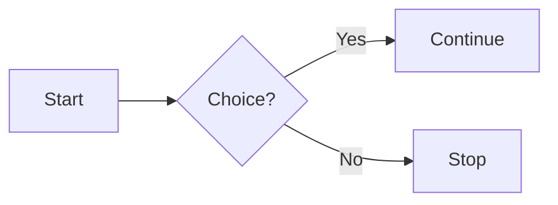

# Authoring

CAFleet's documentation site is built with [Zensical](https://zensical.org/),
which extends Markdown via the Material for MkDocs / pymdownx extension family.
The extensions enabled in `zensical.toml` cover most of what you will need
when writing new pages — admonitions, Mermaid diagrams, code blocks with
syntax highlighting and annotations, content tabs, and footnotes. This page
documents the patterns that are routinely used in the CAFleet docs and
anchors each section to the upstream Zensical reference.

## Admonitions

> See the [Zensical admonitions reference](https://zensical.org/docs/authoring/admonitions/).

Admonitions render as call-out blocks. Use them sparingly — one or two per
page is plenty.

```text
!!! note

    Body text. Markdown formatting works inside the block.

!!! warning "Custom title"

    Use the optional quoted string to override the default title.
```

Renders as:

!!! note

    Body text. Markdown formatting works inside the block.

!!! warning "Custom title"

    Use the optional quoted string to override the default title.

### Collapsible admonitions

> See the [Zensical collapsible-blocks reference](https://zensical.org/docs/authoring/admonitions/#collapsible-blocks).

Replace `!!!` with `???` to make the block collapsible:

```text
??? info "Click to expand"

    Hidden by default until the user clicks.
```

Renders as:

??? info "Click to expand"

    Hidden by default until the user clicks.

## Mermaid diagrams

> See the [Zensical diagrams reference](https://zensical.org/docs/authoring/diagrams/).

Mermaid is registered as a custom fence in `zensical.toml`, so any fenced
code block with the `mermaid` language tag renders as an inline diagram. Use
this for component layouts, sequence diagrams, and state diagrams. The
CAFleet Concepts pages each include one.

````text

````

Renders as:


## Code blocks

> See the [Zensical code-blocks reference](https://zensical.org/docs/authoring/code-blocks/).

Fenced code blocks support a language tag, a `title` attribute, and inline
line highlighting via `hl_lines="N"`:

````text
```python title="Code blocks" hl_lines="2"
def greet(name):
    print(f"Hello, {name}!")
```
````

### Code annotations

> See the [Zensical code-annotations reference](https://zensical.org/docs/authoring/code-blocks/#code-annotations).

Code annotations attach a hover-tooltip note to a specific line. Append a
` # (1)!` comment marker on the source line and a corresponding list item
right after the block:

````text
```python
def greet(name):
    print(f"Hello, {name}!")  # (1)!
```

1.  This is the annotation body. Markdown works here.
````

## Content tabs

> See the [Zensical content-tabs reference](https://zensical.org/docs/authoring/content-tabs/).

Use content tabs to show the same example in multiple languages or for
multiple coding-agent backends:

```text
=== "Claude"

    ```bash
    cafleet --session-id ... member create --coding-agent claude ...
    ```

=== "Codex"

    ```bash
    cafleet --session-id ... member create --coding-agent codex ...
    ```
```

## Footnotes

> See the [Zensical footnotes reference](https://zensical.org/docs/authoring/footnotes/).

Footnotes work via the standard `[^id]` marker. The Zensical theme can render
them as inline tooltips on hover:

```text
Here is a sentence with a footnote.[^1]

[^1]: This is the footnote body.
```

## Cross-links

Every internal cross-link between Zensical source files in this site uses a
**relative path** rooted at the current page's directory. From this page
(`docs/get-started/authoring.md`), the API reference for the broker lives at
`../api/broker.md`; the Concepts overview lives at `../concepts/overview.md`.

Zensical's internal-link rewriter recognizes this form natively — it rewrites
the `.md` suffix to the rendered site URL and validates the target during
build. Avoid root-relative paths (`/api/broker.md`) and absolute site URLs
(`https://himkt.github.io/cafleet/api/broker/`) for in-source links; those
skip the rewriter's validation and break if `site_url` ever changes.
