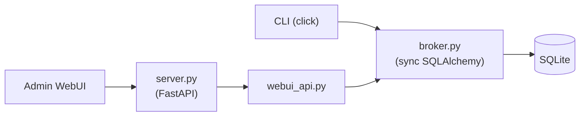

# CAFleet

Agent Teams reinvented for collaborative coding across multiple coding-agent
backends, with full code transparency.

CAFleet is a message broker and agent registry for coding agents. It ships a
unified `cafleet` CLI and an admin WebUI on top of a single-file SQLite
database. Fleets partition agents into isolated namespaces; the CLI accesses
SQLite directly through a shared `broker` module, so no HTTP server is required
for agent operations.

## Component overview

CAFleet works with three coding-agent backends — `claude` (Claude Code), `codex`
(OpenAI Codex CLI), and `opencode` — and members from different backends can
coexist in the same fleet.

[Get started :material-arrow-right:](get-started/){ .md-button .md-button--primary }

## Browse the docs

- [Get Started](get-started/) — install, configure, and quickstart walkthroughs.
- [Concepts](concepts/overview.md) — architecture overview, fleet isolation, storage, member lifecycle, coding agents, bash routing, tmux push notifications, token reduction.
- [Specification](spec/data-model.md) — data model, message envelope, CLI options, WebUI API, plus per-backend operational pages.
- [API Reference](api/broker.md) — Python API documentation generated from source for `cafleet.broker`, `cafleet.config`, `cafleet.coding_agent.base`, and `cafleet.multiplexer.base`.
