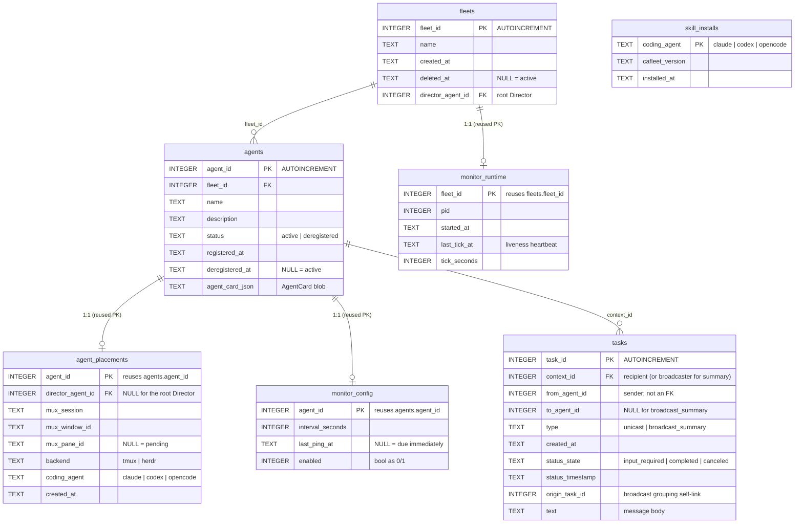

# Data model

The `Task` payload is fully relational: every routing field plus the message
body lives in its own typed column. The only JSON `TEXT` blob is
`agents.agent_card_json`. The runtime engine is SQLAlchemy 2.x with the
synchronous `pysqlite` driver; the schema is managed by a chain of Alembic
migrations bundled inside the wheel — run `cafleet setup` (or `cafleet setup
db`) to migrate to head (idempotent, data-preserving; see
[Storage](../concepts/storage.md)). The exact column-level DDL contract lives
in the repository's `SPEC.md`.

## Schema diagram

The three minted-id tables (`fleets`, `agents`, `tasks`) use `INTEGER PRIMARY
KEY AUTOINCREMENT`, so **ids are never reused** and real ids are always `>= 1`.
The three 1:1 tables reuse a parent id as their PK; `skill_installs` keys on
the coding-agent name and is not FK-linked.

## Tables

### `fleets`

Fleet deletion is a **soft-delete** keyed on `deleted_at`. `cafleet fleet
create` writes the fleet row, the root Director (and its placement), the
`director_agent_id` back-reference, and the built-in Administrator in one
all-or-nothing transaction — which is why `director_agent_id` is DB-nullable
despite the post-bootstrap NOT NULL invariant.

### `agents`

Deregistration is a soft-delete (`status='deregistered'` + `deregistered_at`);
active query paths filter `status='active'`. Special agents are marked by a
broker-owned `cafleet.kind` flag inside `agent_card_json` rather than a column:
`"builtin-administrator"` for the write-only Administrator every fleet owns
exactly one of (it never receives messages or a pane, cannot be deregistered
or made a Director, and is excluded from broadcast recipients), and
`"monitoring-member"` for the fleet's single monitoring member (which skips
`monitor_config` enrollment and is located by this marker — see
[Monitoring](../concepts/monitoring.md)). Callers cannot set `cafleet.kind`
through any public path.

### `tasks`

One row per delivery: a unicast row, a broadcast delivery row, or a broadcast
summary row (see [Broadcast grouping](#broadcast-grouping)). `from_agent_id`
is deliberately not a foreign key — historical tasks may outlive their sender.
`status_timestamp` is updated on every state change and drives `ORDER BY DESC`
listing. The rendered envelope is specified in
[Message envelope](message-envelope.md).

### `agent_placements`

Links an agent to its multiplexer pane; pane ids are stored verbatim as opaque
strings. `director_agent_id` is `NULL` only for the root Director's own
placement; nested teams are forbidden — member registration rejects any
placement whose `director_agent_id` is not the fleet root. Placement rows are
hard-deleted when the agent is deregistered — they have no historical value.

### `monitor_config` and `monitor_runtime`

The two monitor tables: `monitor_config` holds one row per **enrolled** agent
(the root Director and every ordinary member — never the monitoring member,
the Administrator, or placementless agents), hard-deleted alongside the
placement on deregistration; `monitor_runtime` holds one row per fleet with
the running loop's pid and `last_tick_at` heartbeat — "no monitor" is modeled
as "no row". Both are removed explicitly inside the `fleet delete`
transaction. Enrollment, cadence, and liveness semantics are on
[Monitoring](../concepts/monitoring.md).

### `skill_installs`

One upserted row per coding-agent home, recording the CLI version whose skills
install last landed there. Written by `cafleet setup` / `cafleet setup skill`;
feeds the stale-skills guard and the `cafleet doctor` report (see
[CLI options](cli-options.md#stale-skills-guard)).

## Foreign key enforcement

SQLite ignores FK declarations unless `PRAGMA foreign_keys=ON` is issued per
connection; a SQLAlchemy `connect` event listener does so. FKs use
`ON DELETE RESTRICT` except the two 1:1 child tables of `agents`
(`agent_placements`, `monitor_config`), which use `CASCADE` so a hard-deleted
agent cannot leave dangling rows. Normal delete paths are soft-deletes, so
neither fires in practice.

## Task Visibility Rules

Read access is **fleet-scoped**; per-agent identity is enforced only on state
transitions:

| Operation | Enforcement |
|---|---|
| `message poll` | Returns the `input_required` deliveries whose `context_id` equals `--agent-id`; any in-fleet caller can poll any in-fleet inbox by id. |
| `message show` | Returns the task iff at least one endpoint belongs to `--fleet-id`; cross-fleet lookups return "not found". |
| `message ack` | Recipient-only — the caller must equal the task's `context_id`. |
| `message cancel` | Sender-only — the caller must equal the task's `from_agent_id`. |

## Broadcast Grouping

A broadcast produces N+1 rows — one delivery task per active recipient plus
one `broadcast_summary` task — grouped by `origin_task_id`:

| Row kind | `origin_task_id` value |
|---|---|
| Unicast delivery | `NULL` |
| Broadcast delivery row (one per recipient) | The summary task's `task_id` |
| Broadcast summary row | Its own `task_id` (self-reference) |

Because ids are DB-assigned, the summary row is inserted first with a
temporarily `NULL` `origin_task_id`, then self-linked before the delivery rows
are inserted. The grouping predicate `origin_task_id IS NOT NULL` cleanly
partitions the timeline into standalone unicasts vs broadcast groups. The
per-recipient ACK time is read from the `completed` delivery row's
`status_timestamp`, which is valid because a delivery task makes exactly one
state transition over its lifetime.
