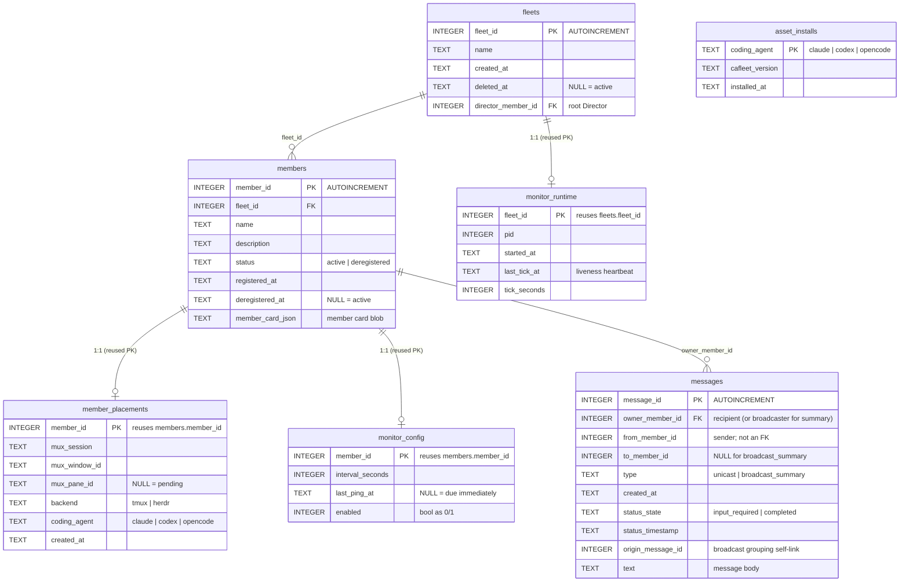

# Data model

The `Message` payload is fully relational: every routing field plus the message
body lives in its own typed column. The only JSON `TEXT` blob is
`members.member_card_json`. The runtime engine is SQLAlchemy 2.x with the
synchronous `pysqlite` driver; the schema is managed by a chain of Alembic
migrations bundled inside the wheel — run `cafleet setup` to migrate to head
(idempotent, data-preserving; see [Storage](../concepts/storage.md)). The exact column-level DDL contract lives
in the repository's `SPEC.md`.

## Schema diagram

Minted ids are **never reused** and real ids are always `>= 1`.

## Tables

| Table | Primary key | Parent | FK ON DELETE | Row removal |
|---|---|---|---|---|
| `fleets` | `INTEGER PRIMARY KEY AUTOINCREMENT` | `members.member_id`, via the nullable `director_member_id` back-reference | `RESTRICT` | Soft-delete keyed on `deleted_at` |
| `members` | `INTEGER PRIMARY KEY AUTOINCREMENT` | `fleets.fleet_id` | `RESTRICT` | Soft-delete (`status='deregistered'` + `deregistered_at`) |
| `messages` | `INTEGER PRIMARY KEY AUTOINCREMENT` | `members.member_id`, via `owner_member_id` | `RESTRICT` | Not deleted |
| `member_placements` | Reuses `members.member_id` | `members` | `CASCADE` | Hard-deleted on deregistration |
| `monitor_config` | Reuses `members.member_id` | `members` | `CASCADE` | Hard-deleted alongside the placement on deregistration, and inside the `fleet delete` transaction |
| `monitor_runtime` | Reuses `fleets.fleet_id` | `fleets` | `RESTRICT` | Removed inside the `fleet delete` transaction; "no monitor" is modeled as "no row" |
| `asset_installs` | `coding_agent` (the agent name) | — | — | Upserted, one row per coding agent |

### `fleets`

`cafleet fleet create` writes the fleet row, the root Director (and its
placement), and the `director_member_id` back-reference in one all-or-nothing
transaction — which is why `director_member_id` is DB-nullable despite the
post-bootstrap NOT NULL invariant.

### `members`

Active query paths filter `status='active'`. Special members are marked by a
broker-owned `cafleet.kind` flag inside `member_card_json` rather than a
column: `"monitoring-member"` marks the fleet's single monitoring member
(which skips `monitor_config` enrollment and is located by this marker — see
[Monitoring](../concepts/monitoring.md)). Callers cannot set `cafleet.kind`
through any public path.

### `messages`

One row per delivery: a unicast row, a broadcast delivery row, or a broadcast
summary row (see [Broadcast grouping](#broadcast-grouping)). `from_member_id`,
`to_member_id`, and `origin_message_id` are deliberately not foreign keys —
historical messages may outlive their sender. `status_timestamp` is updated on
every state change and drives `ORDER BY DESC` listing. The rendered envelope is specified in
[Message envelope](message-envelope.md).

### `member_placements`

Links a member to its multiplexer pane; pane ids are stored verbatim as opaque
strings. The root Director keeps its own placement row (it is pane-bound); an
ordinary member is a placed row other than the fleet's root Director
(`member_id != fleets.director_member_id`). Placement rows have no historical
value.

### `monitor_config` and `monitor_runtime`

The two monitor tables: `monitor_config` holds one row per **enrolled** member,
and `monitor_runtime` holds one row per fleet with the running loop's pid and
`last_tick_at` heartbeat. Which members are enrolled — the watched set — is
defined in
[Monitoring](../concepts/monitoring.md#the-watched-set), along with the
cadence and liveness semantics.

### `asset_installs`

One upserted row per coding agent, recording the CLI version whose skills
and preset (where one exists) install last landed there — the row attests
both. Written by the assets half of `cafleet setup`; feeds the stale-assets
guard and the `cafleet doctor` report (see
[CLI options](cli-options.md#stale-assets-guard)).

## Foreign key enforcement

SQLite ignores FK declarations unless `PRAGMA foreign_keys=ON` is issued per
connection; a SQLAlchemy `connect` event listener does so. FKs use
`ON DELETE RESTRICT` except the `member_id` PK=FK of the two 1:1 child tables
(`member_placements`, `monitor_config`), which uses `CASCADE` so a hard-deleted
member cannot leave dangling rows. Normal delete paths are soft-deletes, so
neither fires in practice.

## Message Visibility Rules

Read access is **fleet-scoped**; per-member identity is enforced only on state
transitions:

| Operation | Enforcement |
|---|---|
| `message poll` | Returns the `input_required` deliveries whose `owner_member_id` equals `--member-id`; any in-fleet caller can poll any in-fleet inbox by id. |
| `message show` | Returns the message iff at least one endpoint belongs to `--fleet-id`; cross-fleet lookups return "not found". |
| `message ack` | Recipient-only — the caller must equal the message's `owner_member_id`. |

## Broadcast Grouping

A broadcast produces N+1 rows — one delivery message per active recipient plus
one `broadcast_summary` message — grouped by `origin_message_id`:

| Row kind | `origin_message_id` value |
|---|---|
| Unicast delivery | `NULL` |
| Broadcast delivery row (one per recipient) | The summary message's `message_id` |
| Broadcast summary row | Its own `message_id` (self-reference) |

Because ids are DB-assigned, the summary row is inserted first with a
temporarily `NULL` `origin_message_id`, then self-linked before the delivery rows
are inserted. The grouping predicate `origin_message_id IS NOT NULL` cleanly
partitions the timeline into standalone unicasts vs broadcast groups. The
per-recipient ACK time is read from the `completed` delivery row's
`status_timestamp`, which is valid because a delivery message makes exactly one
state transition over its lifetime.
