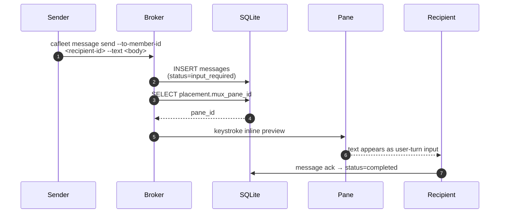

# Multiplexer backends

cafleet hosts every coding-agent member inside a **terminal-multiplexer pane**.
The multiplexer is abstracted behind the `Multiplexer` Protocol, so the
spawn, keystroke-delivery, capture, and teardown paths are backend-neutral. Two backends ship today: **tmux** and
**herdr** ([herdr.dev](https://herdr.dev)). Both satisfy the same Protocol, so
every `member *` path behaves identically regardless of which one is active.

Pane ids are treated as **opaque strings** end to end — tmux ids look like `%7`,
herdr ids look like `w1:p1`; cafleet stores and passes them verbatim and never
parses them.

The pane is also cafleet's only push channel: message delivery stays pull-based
(recipients drain the persisted queue with `cafleet message poll`), and the
broker keystrokes a best-effort inline preview into the recipient's pane after
persisting a message — see [Push notifications](#push-notifications).

## Backend matrix {#backend-matrix}

Where the two backends differ, behavior by behavior:

| Behavior | tmux | herdr |
|---|---|---|
| Pane id shape | `%7` | `w1:p1` |
| Error class | `TmuxError` | `HerdrError` |
| Native agent-state capability | absent | `AgentStateAware`, tracking `working` / `blocked` / `done` / `idle` / `unknown` |
| Access mechanism | Shells out to `tmux` | Uses the herdr CLI as a subprocess |
| Pane-spawn cwd | Builtin inheritance from the splitting pane | Explicit `--cwd <dir>` on every `herdr pane split` |
| Delete-time layout reflow | Native auto-fit after a bare `kill-pane` | No native reflow — `kill_pane` rebalances best-effort, scoped to the killed pane's tab |
| `send_prompt` shell form | Payload `! <stripped>` + `Enter`, no leading `Esc` | `herdr pane run <pane> "! <stripped>"`, no `Esc` |
| `send_prompt` plain form | Payload `<stripped>` + `Enter` with a leading `Esc` (`esc_first=not shell`) | `Esc` first, then `herdr pane run <pane> <stripped>` |
| Inline-preview keystroke | `send-keys` | `pane send-text` + `pane send-keys` |

`TmuxError` and `HerdrError` are both subclasses of `MultiplexerError`. Each
behavior's full contract stays under its own heading below.

## Backend selection {#backend-selection}

Every call site resolves its backend through `resolve_multiplexer()`
([API reference](../api/multiplexer.md)) rather than hardcoding one. Resolution
precedence:

1. **Explicit override.** If `CAFLEET_MULTIPLEXER` is set, it must name a
   supported backend (`tmux` or `herdr`); an unknown value fails loudly.
2. **Auto-detect from the environment.** `HERDR_ENV` truthy signals a herdr
   session; `TMUX` set signals a tmux session.
3. **Ambiguity is a hard error.** Both `HERDR_ENV` and `TMUX` set → error
   (set `CAFLEET_MULTIPLEXER` to disambiguate). Neither set → error (run cafleet
   inside a tmux or herdr session, or set `CAFLEET_MULTIPLEXER`). Exactly one
   present → that backend.

The outcomes of that order:

| `CAFLEET_MULTIPLEXER` | `HERDR_ENV` | `TMUX` | Result |
|---|---|---|---|
| `tmux` or `herdr` | any | any | That backend |
| An unknown value | any | any | Fails loudly |
| unset | truthy | set | Error — set `CAFLEET_MULTIPLEXER` to disambiguate |
| unset | truthy | unset | herdr |
| unset | not truthy | set | tmux |
| unset | not truthy | unset | Error — run cafleet inside a tmux or herdr session, or set `CAFLEET_MULTIPLEXER` |

The four override-set combinations collapse into the first two rows because an
explicit override wins outright, whatever the environment holds.

Auto-detect (an unset `CAFLEET_MULTIPLEXER`) is the default: absence is a valid,
well-defined state. `cafleet doctor` reports the resolved backend and its
identifiers (see [CLI options](cli-options.md#cafleet-doctor)).

## Error taxonomy

Backend failures share a base `MultiplexerError`, with the per-backend
subclasses in the [backend matrix](#backend-matrix). CLI boundaries catch
`MultiplexerError`, so both backends' failures are handled uniformly while each
backend keeps its own message text.

## Native agent-state (herdr only) {#native-agent-state}

herdr natively tracks each agent's lifecycle state
(`working`/`blocked`/`done`/`idle`/`unknown`), exposed through a separate
optional capability Protocol, `AgentStateAware`, that only the herdr backend
implements — the base `Multiplexer` Protocol stays clean and tmux implements
nothing new.

On the herdr backend the monitor loop point-reads each watched member's native
agent status per tick, which adds a fourth wake trigger:

| Wake trigger | tmux | herdr |
|---|---|---|
| interval | yes | yes |
| stall-check | yes | yes |
| unacked | annotation only on an already-due row | annotation only on an already-due row |
| Native agent status transitions into `done` | no — the capability is absent | yes — the sole wake-on-status state (`_WAKE_ON_STATUS = ("done",)`) |

A transition into `blocked` is recorded but never flags a wake: a blocked
member is awaiting a user answer and must not be woken about. No DB column
backs the native status; the last-seen state lives only in the running loop's
memory. See [Monitoring](../concepts/monitoring.md).

## Synchronized monitor wake and fixed direct nudge

The monitor loop remains one fixed-cadence
`scan → one synchronized watcher wake → sleep` path on both backends. It never
calls `send_poll_trigger` and never keystrokes a watched pane. `unacked` is
appended only as an annotation after interval, durable stall-check, and native
done trigger construction; a stale delivery cannot create a due row.

`send_wake_trigger` receives every due target plus the Director descriptor.
Each rendered entry includes a sanitized name and sanitized
`coding_agent=<claude|codex|opencode>` so the monitoring member applies the
target's overlay cues. tmux and herdr emit a byte-identical policy payload that
requires JSON capture at `--lines 120 --no-ansi`, durable
`stall_candidate` observation, and broker claim before action.

The monitoring member may reuse the existing `cafleet member ping` only when
the broker returns `action = ping` for a confidently stalled ordinary member.
The primitive is unchanged on both backends: `Esc`, a literal target
`cafleet message poll`, then `Enter`. It cannot carry arbitrary text, cannot
target the Director/monitoring member, and runs at most once per durable stall
episode.

At the end of the wake, a fresh safe Director-gate token authorizes one
`monitor report-batch`. The command may invoke `send_inline_preview` at most
once for the fleet's open aggregate. Failure/success recovery always retries
the **same message ID**; one-open backpressure prevents a second aggregate
preview in that wake. The Director retrieves the aggregate with
`message show --full` before processing and ACK.

## Access mechanism

Each backend's access mechanism is in the [backend matrix](#backend-matrix) —
no new Python dependency either way; the binary is expected on `PATH`. herdr
also exposes a JSON unix-socket API whose only unique
capability is a push event stream; that would require a persistent connection
and a concurrent reader that cafleet's synchronous `scan → wake → sleep`
monitor loop does not have, so the socket stream is a deliberately-deferred
optimization.

## Pane spawn working directory {#pane-spawn-cwd}

A member pane spawned by `cafleet member create` starts in the invoking
process's working directory (the Director's pane cwd); each backend realizes
this differently, per the [backend matrix](#backend-matrix).

On herdr, `<dir>` is `os.getcwd()` of the invoking process. herdr's own
inheritance is not relied upon because herdr spawns `/bin/sh` instead of the
passwd login shell when `SHELL` is unset
([herdr discussion #1517](https://github.com/ogulcancelik/herdr/discussions/1517)).
An unresolvable cwd fails the spawn loudly with `HerdrError`; there is no
fallback directory.

## Delete-time pane layout {#delete-time-pane-layout}

Closing a member pane leaves the two backends asymmetric on layout reflow, per
the [backend matrix](#backend-matrix).

herdr's `kill_pane` reads the target pane's tab (`herdr pane get`) before the
close, runs `herdr pane close`, then rebalances. The scoping comes from the
layout read itself: the killed pane is gone, so the rebalance picks a pane
still open in that tab (`herdr pane list`) and anchors the geometry read on it
(`herdr pane layout --pane <surviving>`), which returns that tab's layout
regardless of which tab or pane holds focus. When no pane remains in the tab,
there is nothing to rebalance and the step is skipped. With ≥ 2 members
remaining, the member column is re-equalized to equal heights (the same
invariant the create path enforces); after the last member is deleted, the
Director pane is explicitly restored to full tab width when the layout read
shows a residual right split; a single remaining member needs no resize. The
rebalance silently skips on unexpected layout shapes. Any `HerdrError` during
the rebalance is swallowed: a layout failure never fails `member delete` — the
pane is closed and the member deregistered regardless.

## Prompt dispatch (`send_prompt`) {#prompt-dispatch}

`cafleet member prompt` delivers its keystrokes through the Protocol method

```python
def send_prompt(self, *, target_pane_id: str, text: str, shell: bool = False) -> None
```

Both backends validate fail-fast: text empty after strip →
`send_prompt: text may not be empty`; the **original** text containing `\n` or
`\r` → `send_prompt: text may not contain newlines` (raised as the backend's
native error type, `TmuxError` / `HerdrError`). The `shell` flag controls both
the payload prefix and the Esc safeguard; the per-backend payloads are in the
[backend matrix](#backend-matrix). herdr's plain form mirrors
`send_poll_trigger`'s esc-then-run shape.

## Push notifications {#push-notifications}

CAFleet's delivery model is pull-based: recipients discover messages via
`cafleet message poll`. To cut latency, the broker keystrokes a 2-line inline
preview into the recipient's pane immediately after persisting a message, so
the recipient's coding agent consumes it as a fresh user-turn input:

```text
[cafleet msg <message_id> from <sender_id> <ts>]
<text-truncated-to-CAFLEET_MAX_TEXT_LEN>
```

The keystroke is dispatched through the resolved backend's
`send_inline_preview` helper; the contract — one Esc-safeguarded submit of the
whole 2-line payload — is identical on both, and the per-backend realization is
in the [backend matrix](#backend-matrix).



The recipient pane is resolved from `member_placements` by `member_id` alone,
so Member → Director notifications work automatically. The recipient acks via
`cafleet message ack --message-id <message_id>` once it has consumed the message.
Body truncation in the preview (`…` at `CAFLEET_MAX_TEXT_LEN` codepoints) is
documented in [CLI options](cli-options.md#message-body-truncation).

Monitor aggregates use the same preview mechanism, but delivery state is
durable: a successful preview remains `awaiting_ack`, an interval-stale retry
reuses the same message ID, and only Director ACK completes it. The preview is
notification only; its full body is retrieved by ID before action.

### The `Esc` safeguard {#esc-safeguard}

Where a path leads with `Esc`, the mechanism is the same: it presses `Escape`,
lets the pane settle ~0.1 s, then types the payload and `Enter`.

| Keystroke path | Leads with `Esc`? | Payload | Why |
|---|---|---|---|
| Inline preview (`message send` / `message broadcast`) | yes (`esc_first=True`) | The 2-line preview + `Enter` | A recipient parked on a pending permission-approval prompt has it dismissed before the trailing `Enter` lands |
| `cafleet member ping` | yes (`send_poll_trigger`, `esc_first=True`) | A literal `cafleet message poll` command + `Enter` | The manual re-poke for a pane that missed an inline preview |
| `cafleet member prompt` (plain form) | yes | The text + `Enter` | The same safeguard, protecting the submitted user turn |
| `cafleet member prompt --shell` | **no** — a deliberate omission | `! <cmd>` + `Enter` | `! <cmd>` must land in the bare composer, and an `Esc` before it would mis-fire (see [Prompt dispatch](#prompt-dispatch)) |
| Monitor-loop wake nudge | no | — | It targets only the monitoring member's own pane, which is never parked on a permission prompt (see [Monitoring](../concepts/monitoring.md)) |

### Design principles

- **Best-effort**: the message queue remains the sole source of truth; a failed
  push leaves the message available for normal polling.
- **Self-send skip**: when sender == recipient, the notification is suppressed.
- **Silent failure**: missing placements, null `mux_pane_id`, dead panes, and
  an absent multiplexer binary all result in no notification — no exceptions
  propagate to the caller.
- **No multiplexer env var required**: the keystroke targets the pane by id
  (tmux `send-keys -t <pane>`, herdr `pane send-*`), which works from any
  process on the same host as long as the multiplexer's server is reachable.

### Response annotations

Unicast responses include a top-level `notification_sent` boolean. Broadcast
responses expose `recipients` (the real recipient count) and `delivered` (how
many recipient panes were successfully triggered) as top-level wrapper fields.
Neither count is persisted — they live only in the broker return value.
