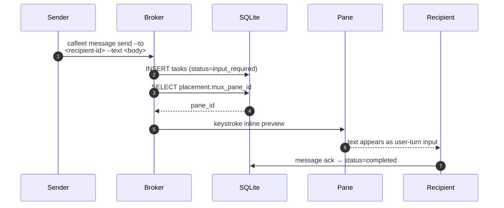

# Multiplexer backends

The contract behind the [Multiplexer backends](../concepts/multiplexer-backends.md)
concept: how a backend is resolved, how failures surface, what the optional
capabilities are, and the exact push-notification mechanics.

## Backend selection {#backend-selection}

Every call site resolves its backend through `resolve_multiplexer()`
([API reference](../api/multiplexer.md)) rather than hardcoding one. Resolution
precedence:

1. **Explicit override.** If `CAFLEET_MULTIPLEXER` is set, it must name a
   supported backend (`tmux` or `herdr`); an unknown value fails loudly.
2. **Auto-detect from the environment.** `HERDR_ENV` truthy signals a herdr
   session; `TMUX` set signals a tmux session.
3. **Ambiguity is a hard error.** Both `HERDR_ENV` and `TMUX` set → error
   (set `CAFLEET_MULTIPLEXER` to disambiguate). Neither set → error (run cafleet
   inside a tmux or herdr session, or set `CAFLEET_MULTIPLEXER`). Exactly one
   present → that backend.

Auto-detect (an unset `CAFLEET_MULTIPLEXER`) is the default: absence is a valid,
well-defined state. `cafleet doctor` reports the resolved backend and its
identifiers (see [CLI options](cli-options.md#cafleet-doctor)).

## Error taxonomy

Backend failures share a base `MultiplexerError`, with `TmuxError` and
`HerdrError` as backend-specific subclasses. CLI boundaries catch
`MultiplexerError`, so both backends' failures are handled uniformly while each
backend keeps its own message text.

## Native agent-state (herdr only) {#native-agent-state}

herdr natively tracks each agent's lifecycle state
(`working`/`blocked`/`done`/`idle`/`unknown`), exposed through a separate
optional capability Protocol, `AgentStateAware`, that only the herdr backend
implements — the base `Multiplexer` Protocol stays clean and tmux implements
nothing new.

On the herdr backend the monitor loop point-reads each watched agent's native
status per tick and flags it due when the status transitions into `done` — the
sole wake-on-status state (`_WAKE_ON_STATUS = ("done",)`) — in addition to the
interval and stall-check triggers. A transition into `blocked` is recorded but
never flags a wake: a blocked agent is awaiting a user answer and must not be
woken about. On the tmux backend the capability is absent, so agents come due
by interval and stall-check only. No DB column backs the native status; the
last-seen state lives only in the running loop's memory. See
[Monitoring](../concepts/monitoring.md).

## Access mechanism

The herdr backend uses the **herdr CLI** exclusively (subprocess), mirroring how
the tmux backend shells out to `tmux` — no new Python dependency; the binary is
expected on `PATH`. herdr also exposes a JSON unix-socket API whose only unique
capability is a push event stream; that would require a persistent connection
and a concurrent reader that cafleet's synchronous `scan → wake → sleep`
monitor loop does not have, so the socket stream is a deliberately-deferred
optimization.

## Push notifications {#push-notifications}

CAFleet's delivery model is pull-based: recipients discover messages via
`cafleet message poll`. To cut latency, the broker keystrokes a 2-line inline
preview into the recipient's pane immediately after persisting a message, so
the recipient's coding agent consumes it as a fresh user-turn input:

```text
[cafleet msg <task_id> from <sender_id> <ts>]
<text-truncated-to-CAFLEET_MAX_TEXT_LEN>
```

The keystroke is dispatched through the resolved backend's
`send_inline_preview` helper — tmux realizes it with `send-keys`, herdr with
`pane send-text` + `pane send-keys`; the contract (one Esc-safeguarded submit
of the whole 2-line payload) is identical on both.



The recipient pane is resolved from `agent_placements` by `agent_id` alone, so
Member → Director notifications work automatically. The recipient acks via
`cafleet message ack --task-id <task_id>` once it has consumed the message.
Body truncation in the preview (`…` at `CAFLEET_MAX_TEXT_LEN` codepoints) is
documented in [CLI options](cli-options.md#message-body-truncation).

### The `Esc` safeguard {#esc-safeguard}

The preview keystroke **leads with `Esc`** (`send_inline_preview` is called
with `esc_first=True`): it presses `Escape`, lets the pane settle ~0.1 s, then
types the payload and `Enter`, so a recipient parked on a pending
permission-approval prompt has that prompt dismissed before the trailing
`Enter` lands. The same `Esc`-safeguarded path serves `message send`,
`message broadcast`, and `member nudge`. Two related keystroke paths differ:

- `cafleet member ping` injects `Esc` → a literal `cafleet message poll`
  command → `Enter` (the `send_poll_trigger` helper, also `esc_first=True`) —
  the manual re-poke for a pane that missed an inline preview.
- The monitor loop's wake nudge targets only the monitoring member's own pane,
  which is never parked on a permission prompt, so it does **not** lead with
  `Esc` (see [Monitoring](../concepts/monitoring.md)).

### Design principles

- **Best-effort**: the message queue remains the sole source of truth; a failed
  push leaves the message available for normal polling.
- **Self-send skip**: when sender == recipient, the notification is suppressed.
- **Silent failure**: missing placements, null `mux_pane_id`, dead panes, and
  an absent multiplexer binary all result in no notification — no exceptions
  propagate to the caller.
- **No multiplexer env var required**: the keystroke targets the pane by id
  (tmux `send-keys -t <pane>`, herdr `pane send-*`), which works from any
  process on the same host as long as the multiplexer's server is reachable.

### Response annotations

Unicast responses include a top-level `notification_sent` boolean. Broadcast
responses expose `recipients` (the real recipient count) and `delivered` (how
many recipient panes were successfully triggered) as top-level wrapper fields.
Neither count is persisted — they live only in the broker return value.
